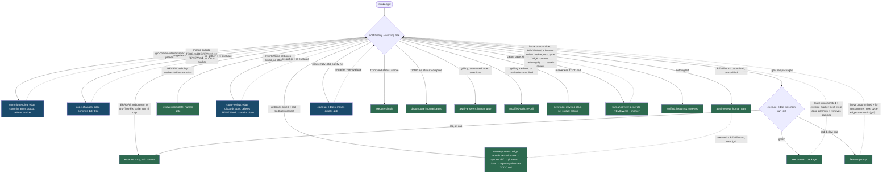

# gi[t]hings.**done**

> [!WARNING] This project is an experiment in unapologetic vibe coding. Code
> might be terrible, I don't even know 🤷‍♂️ But otherwise I wouldn't have built it
> in the first place. Now I have something that actually helps me.

A git-aware agent skill that emits the next prompt for an autonomous coding
agent based on the current repository state — plan, refine the plan, decompose
into work packages, execute with parallel subagents, commit, or verify the
working tree is healthy.

Internally, gtd is an [xstate](https://stately.ai/docs/xstate) event-sourced
state machine used as a **pure fold** over git history. The Effect "edge"
(`src/Events.ts`) reads the first-parent commit subjects since the merge-base
with the default branch (whole-history fallback when there is no default branch
or merge-base) plus the working tree, turns them into a `COMMIT[]` + single
`RESOLVE` event stream, and folds them through the IO-free machine
(`src/Machine.ts`). The fold lands on exactly **one** active leaf state, which
selects the prompt. There is no multi-section/branches-array snapshot — a single
run resolves to a single state.

The machine is a **stepping** actor, not a one-shot fold: it owns the no-agent
action loop and both side-effect gates in machine logic. A settled leaf can
expose an `edgeAction` (`removeGtdDir` / `closeReview` / `commitPending` /
`runTestGate` / `reviewPreRender`) telling the IO edge to perform one side
effect and feed the result back as a `TEST_RESULT` / `REVIEW_RECORDED` event (or
a freshly re-gathered `RESOLVE`); the machine re-evaluates and projects the next
state. Agent prompts never run `git commit` themselves: every agent leaves its
output **uncommitted** plus a `.gtd-commit-intent` sentinel naming the producing
state (`execute` / `decompose` / `new-todo` / `modified-todo` / `execute-simple`
/ `human-review` / `fix-tests`). The next cycle's edge reads that marker
(READ-ONLY in `src/Events.ts`), the machine folds it to a disambiguated
`commitPending` edge action (ahead of the generic `code-changes` leaf), and the
edge computes the message and commits — deleting the marker (and, for `execute`,
the consumed `.gtd/NN-…` package dir) in the same commit. The machine stays
pure: it only maps the intent to the action and its cleanup flags; the edge
derives any content-based message (`COMMIT_MSG.md`, package count, review
short-sha, TODO.md heading, and the load-bearing `Gtd-Test-Fix:` trailer). The
edge opens the actor via `startDetect()` in `src/State.ts` and advances the same
handle — the machine stays pure (no IO/Effect/git). The no-agent loop is bounded
by `MAX_NO_AGENT_HOPS` (8) and a `stuck` guard (re-settling on the same no-agent
leaf with no progress); either escalates.

`gtd` ships as an [Agent Skills Spec](https://agentskills.io/specification)
compliant skill installable via [skills.sh](https://www.skills.sh/). The agent
runs the bundled script, reads the emitted prompt, and follows it verbatim.

## Installation

```bash
npx skills add pmelab/gtd -g -y
```

That's it. No npm install, no config file, no setup subcommand. The skill
bundles its own prebuilt script.

## Usage

Inside the agent (Claude Code, Codex, etc.), either:

- Type `/gtd` to invoke the skill directly, **or**
- Say something like "take the next step", "what's next", or "gtd" — the skill's
  description matcher picks it up.

The agent runs `node scripts/gtd.js` in your current working directory and acts
on the emitted prompt.

## What it does

`gtd` folds git history + the working tree into a single active leaf state and
emits the one prompt for that state. The guards are evaluated in a fixed
priority order, so exactly one state wins per run:

Planning state is driven by `TODO.md`'s `status:` frontmatter (`grilling` /
`complete` / `simple`) — the in-file marker is the source of truth — and human
changes are always committed verbatim **first**, before any gate is evaluated.

| Leaf state          | When it wins (first matching guard, top to bottom)                                                                                | Prompt                                                                                                                                                                                                                                                                                                                          |
| ------------------- | --------------------------------------------------------------------------------------------------------------------------------- | ------------------------------------------------------------------------------------------------------------------------------------------------------------------------------------------------------------------------------------------------------------------------------------------------------------------------------- |
| `escalate`          | A committed `ERRORS.md` is present, OR the trailing run of `Gtd-Test-Fix:`-trailer commits hit the cap                            | Stop; surface the failure, keep `ERRORS.md` as the human gate                                                                                                                                                                                                                                                                   |
| `commit-pending`    | A `.gtd-commit-intent` marker is present (an agent left output for the edge to commit)                                            | EDGE-DRIVEN: commit the agent's output with the intent-derived message, delete the marker (and, for `execute`, the consumed package dir); no prompt                                                                                                                                                                             |
| `code-changes`      | Any uncommitted change outside `TODO.md`/`REVIEW.md`, **no `REVIEW.md` present**, and **no intent marker**                        | EDGE-DRIVEN: the edge commits the dirty tree with `git add -A`, leaving `TODO.md`/`REVIEW.md` uncommitted; no agent prompt                                                                                                                                                                                                      |
| `await-review`      | `REVIEW.md` committed and unmodified (no feedback yet)                                                                            | Human gate — wait for the reviewer to work through `REVIEW.md`; **STOP**                                                                                                                                                                                                                                                        |
| `review-incomplete` | `REVIEW.md` dirty and at least one checkbox is still unchecked                                                                    | Human gate — report that the review is unfinished and stop; the human must tick all boxes before re-running gtd                                                                                                                                                                                                                 |
| `close-review`      | `REVIEW.md` dirty, ALL boxes ticked, and no other change (no non-tick REVIEW.md edits, no dirty source, no untracked files)       | EDGE-DRIVEN: the edge discards the ticks, deletes `REVIEW.md`, and commits the close; no agent prompt                                                                                                                                                                                                                           |
| `review-process`    | `REVIEW.md` dirty, all boxes ticked, AND real feedback present (non-tick REVIEW.md edits, dirty source files, or untracked files) | EDGE-DRIVEN: the edge commits the verbatim dirty tree (`docs(review): record raw feedback for <base>`), captures the diff, `git revert`s that commit, removes `REVIEW.md`, and closes (`chore(gtd): close approved review for <sha>`) — all before the agent runs. The agent only synthesizes `TODO.md` from the injected diff. |
| `execute`           | `.gtd/` contains numbered work packages                                                                                           | Edge runs `npm run test` first; on green, name the single next package and inline its tasks (one subagent per task), then leave the work uncommitted with an `execute` marker (the edge commits it and removes the consumed package dir); on red, fix-tests (or escalate)                                                       |
| `cleanup`           | `.gtd/` exists but holds no packages                                                                                              | EDGE-DRIVEN: the edge removes the empty `.gtd/` directory; no agent prompt — vestigial safety net                                                                                                                                                                                                                               |
| `execute-simple`    | `TODO.md` `status: simple` (≤5 files), or legacy `<!-- simple -->`                                                                | Implement the simple plan directly, no decomposition                                                                                                                                                                                                                                                                            |
| `decompose`         | `TODO.md` `status: complete`                                                                                                      | Record `TODO.md`, then decompose into ordinal, dependency-ordered packages                                                                                                                                                                                                                                                      |
| `await-answers`     | `TODO.md` `status: grilling`, committed, with open questions remaining                                                            | Human gate — wait for the user to answer the open questions; **STOP**                                                                                                                                                                                                                                                           |
| `modified-todo`     | `TODO.md` `status: grilling` and edited, or a markerless `TODO.md` modified in place                                              | Incorporate edits, re-grill, move resolved Q&A to `## Resolved`, set `status:` when done                                                                                                                                                                                                                                        |
| `new-todo`          | A markerless `TODO.md` (fresh sketch), committed or newly added                                                                   | Develop the plan: add `## Open Questions`, set `status: grilling`                                                                                                                                                                                                                                                               |
| `human-review`      | Clean tree, a review base exists, and `base..HEAD` has a non-empty diff                                                           | Generate `REVIEW.md` (no test gate) + write the `human-review` intent marker, then **auto-advance**: the next cycle's edge `commit-pending` commits `REVIEW.md` clean and resolves to the `await-review` human gate                                                                                                             |
| `verified`          | Nothing else matched — tree clean, nothing left to review                                                                         | Report the working tree healthy and reviewed                                                                                                                                                                                                                                                                                    |

> **`fix-tests` is a machine leaf state.** When the chain would settle on
> `execute`, the machine first emits a `runTestGate` edgeAction; the edge runs
> the hardcoded `npm run test` and feeds the exit code back as `TEST_RESULT`.
> The machine then folds it: green → `execute`, red below cap → `fix-tests`
> (carrying the captured output on `context.testOutput`), red at/over cap →
> `escalate`. `human-review` is **not** test-gated — it generates `REVIEW.md`
> and auto-advances (the edge commits it on the next cycle). The `fix-tests`
> prompt embeds the captured failure output and instructs the agent to make
> exactly ONE fix, leave it uncommitted with a `fix-tests` marker (the edge then
> commits it with a `fix(gtd): …` subject and the `Gtd-Test-Fix: <n>` trailer),
> then re-run gtd so the gate re-evaluates.

> **Review base**: the closest-to-HEAD of {parent-branch merge-base, last
> `<!-- base: … -->` review commit, last `chore(gtd): close approved review`
> commit}, restricted to ancestors of HEAD. When no base exists or `base..HEAD`
> is empty, there is nothing to review. Because the close commit itself becomes
> the new base, the run immediately after a close resolves to `verified`.

> **Test-fix loop**: the fix-tests prompt drives an internal loop — read the
> uncommitted `ERRORS.md` attempt log, make one fix, re-run, append the attempt,
> repeat up to **3** (the hardcoded `MAX_VERIFY_ITERATIONS` — **not**
> overridable via `.gtdrc`). Nothing is committed per attempt, and the agent
> never commits at all: on success it leaves the fix uncommitted with a
> `fix-tests` marker (`ERRORS.md` discarded) and the next cycle's edge makes the
> single `fix(gtd): …` commit carrying the `Gtd-Test-Fix: <n>` trailer; on
> escalation it leaves `ERRORS.md` for the edge to commit as the human gate. The
> trailing run of commits carrying a `Gtd-Test-Fix:` trailer at HEAD is counted
> in the Effect edge; reaching the cap, a recurring failure signature, or a
> committed `ERRORS.md` all resolve to `escalate`. Any commit WITHOUT a
> `Gtd-Test-Fix:` trailer resets the counter to 0; deleting `ERRORS.md` clears
> the gate. `src/Machine.ts` stays pure/IO-free.

> **Deterministic test execution**: when the chain would settle on `execute`,
> the machine emits a `runTestGate` edgeAction and gtd runs the test suite
> **itself** in the Effect edge — not the agent. It spawns the configured
> `testCommand` (defaults to `npm run test`; see
> [Configuration](#configuration)), captures stdout + stderr + the exit code,
> and feeds it back as a `TEST_RESULT` event. The **machine** then branches: a
> green run (exit 0) settles `execute`; a red run below the verify cap settles
> `fix-tests` with the captured output on context; a red run at/over the cap
> settles `escalate`. The branching (formerly the edge's `selectPrompt`) now
> lives in the machine; `src/Machine.ts` stays pure — only the actual test run
> lives in the edge.

> **Any working-tree change is feedback** — there is no marker convention.
> Taxonomy: REVIEW.md prose edits = global feedback on the whole change or named
> areas; source-file comment additions = local, inline feedback on specific
> lines; source-file code changes = illustrative suggestions (verify
> independently, do not apply verbatim). Unchecked boxes gate first →
> `review-incomplete`. All boxes ticked with no other change → `close-review`.
> All boxes ticked with real feedback (prose edits, source comments, or source
> code changes) → `review-process`.
>
> `review-process` is **edge-driven**: the gtd process itself commits the
> verbatim dirty tree as `docs(review): record raw feedback for <base>`,
> captures the diff in memory, `git revert`s that commit, removes `REVIEW.md`,
> and closes with `chore(gtd): close approved review for <short-sha>` — all
> before the agent runs. The agent only synthesizes `TODO.md` from the injected
> diff. On a revert conflict the edge aborts and exits 1; recover the feedback
> with `git show <record-sha>`.
>
> While `REVIEW.md` is present the `reviewPresent` gate suppresses
> `code-changes`, so any source edits the reviewer made are **not** committed
> separately — they arrive uncommitted and are folded into the verbatim record
> commit by the edge.

gtd coordinates phases — it doesn't dictate strategy. How to grill, how to
commit, how to build, how to verify: those are left to other skills (or the
agent's own judgement). The prompts only describe **intent**, plus the `TODO.md`
and `.gtd/` plumbing that lets phases bridge across runs.

Every prompt also includes the current `git diff HEAD` (untracked files
included) inline.

## Configuration

gtd reads an optional `.gtdrc` config file via
[cosmiconfig](https://github.com/cosmiconfig/cosmiconfig). With no config, the
built-in defaults apply. Supported filenames (searched in this order):

- `.gtdrc`
- `.gtdrc.json`
- `.gtdrc.yaml`
- `.gtdrc.yml`
- `gtd.config.json`
- `gtd.config.yaml`

### Schema

- **`testCommand`** (string) — the command gtd runs in the Effect edge to verify
  the `execute` path only (test gate fires before execute; `human-review` is not
  test-gated and settles directly). Previously hardcoded to `npm run test`; now
  overridable. (The per-edge test-fix cap — `MAX_VERIFY_ITERATIONS` — stays
  fixed and is **not** overridable.)
- **`models`** — model selection for subagent-spawning states:
  - `planning` — high-reasoning model for developing plans, grilling, and
    decomposing work packages.
  - `execution` — everyday model for implementing tasks, running tests, fixing
    failures.
  - `states.*` — per-state overrides for the 5 subagent-spawning states:
    `new-todo`, `modified-todo`, `decompose`, `execute`, `execute-simple`.
    Unknown `models.states` keys (e.g. `fix-tests`) are **rejected**.

### Defaults (no config)

- `testCommand`: `npm run test`
- `models.planning`: `claude-opus-4-8`
- `models.execution`: `claude-sonnet-4-8`

### Lookup and precedence

gtd walks from the current working directory **up to your home directory** (or
to the filesystem root when cwd is outside home), collecting every `.gtdrc` it
finds along the way. All found levels are **merged**, with the **innermost (cwd)
config winning** on conflicts.

This makes the worktree-parent case easy: drop a single `.gtdrc` in a shared
parent directory and it cascades to **all** checkouts/worktrees beneath it,
while any individual checkout can still override settings with its own `.gtdrc`.

### Example

```yaml
# .gtdrc.yaml
testCommand: pnpm test
models:
  planning: claude-opus-4-8
  execution: claude-sonnet-4-8
  states:
    decompose: claude-opus-4-8
    execute: claude-sonnet-4-8
```

## Workflow

The machine evaluates guards in priority order and resolves to a single leaf
state per run:


```mermaid
flowchart TD
    Start([Invoke /gtd]) --> Resolve{Fold history + working tree}
    Resolve -->|"ERRORS.md present or Gtd-Test-Fix: trailer run hit cap"| Escalate[escalate: stop, ask human]:::terminal
    Resolve -->|".gtd-commit-intent marker present"| CommitPending["commit-pending: edge commits agent output, deletes marker"]:::edge
    CommitPending -.->|re-gather + re-evaluate| Resolve
    Resolve -->|"change outside TODO.md/REVIEW.md, no REVIEW.md, no intent marker"| CodeChanges["code-changes: edge commits dirty tree"]:::edge
    CodeChanges -.->|re-gather + re-evaluate| Resolve
    Resolve -->|REVIEW.md committed, unmodified| AwaitReview[await-review: human gate]:::terminal
    Resolve -->|"REVIEW.md dirty, unchecked box remains"| ReviewIncomplete[review-incomplete: human gate]:::terminal
    Resolve -->|"REVIEW.md all boxes ticked, no other change"| CloseReview["close-review: edge discards ticks, deletes REVIEW.md, commits close"]:::edge
    CloseReview -.->|re-gather + re-evaluate| Resolve
    Resolve -->|"all boxes ticked + real feedback present"| ReviewProcess["review-process: edge records verbatim tree → captures diff → git revert → close → agent synthesizes TODO.md"]:::terminal
    Resolve -->|.gtd/ has packages| ExecuteTest{execute: edge runs npm run test}
    ExecuteTest -->|green| Execute[execute next package]:::terminal
    ExecuteTest -->|"red, below cap"| FixTests[fix-tests prompt]:::terminal
    ExecuteTest -->|red, at cap| Escalate
    Execute -.->|"leave uncommitted + execute marker; next cycle edge commits + removes package"| Resolve
    Resolve -->|"stray empty .gtd/ safety net"| Cleanup["cleanup: edge removes empty .gtd/"]:::edge
    Cleanup -.->|re-gather + re-evaluate| Resolve
    Resolve -->|TODO.md status: simple| ExecuteSimple[execute-simple]:::terminal
    Resolve -->|TODO.md status: complete| Decompose[decompose into packages]:::terminal
    Resolve -->|grilling, committed, open questions| AwaitAnswers[await-answers: human gate]:::terminal
    Resolve -->|"grilling + edited, or markerless modified"| ModifiedTodo[modified-todo: re-grill]:::terminal
    Resolve -->|markerless TODO.md| NewTodo["new-todo: develop plan, set status: grilling"]:::terminal
    Resolve -->|"clean, base..HEAD has diff"| HumanReview[human-review: generate REVIEW.md + marker]:::terminal
    Resolve -->|nothing left| Verified[verified: healthy & reviewed]:::terminal
    FixTests -.->|"leave uncommitted + fix-tests marker; next cycle edge commits fix(gtd):…"| Resolve
    HumanReview -.->|"leave uncommitted REVIEW.md + human-review marker; next cycle edge commits review(gtd):… → await-review"| Resolve
    AwaitReview -.->|"user works REVIEW.md, next /gtd"| ReviewProcess
    classDef terminal fill:#2d6a4f,color:#fff
    classDef edge fill:#1a4a6b,color:#fff
```

A typical feature:

1. Create a `TODO.md` with a sketch of what you want.
2. `/gtd` — the agent (using the planning model) fleshes it out, adds
   `status: grilling` frontmatter, appends an `## Open Questions` section, and
   leaves `TODO.md` uncommitted with a `new-todo` marker; the edge commits
   `docs(plan): record TODO.md`. The next run is a human gate (`await-answers`)
   until you answer.
3. Open `TODO.md`, write inline answers under each question.
4. `/gtd` again — the agent integrates your answers, moves resolved questions to
   the `## Resolved` graveyard, raises new ones, and leaves `TODO.md`
   uncommitted with a `modified-todo` marker; the edge commits
   `docs(plan): record TODO.md`. When no questions remain, the agent sets
   `status: simple` (≤5 files) or `status: complete`. Repeat until the status is
   set.
5. `/gtd` once more — the agent records `TODO.md` (when not already in `HEAD`)
   and decomposes it into work packages in `.gtd/`, deletes `TODO.md`, and
   leaves the tree uncommitted with a `decompose` marker; the edge commits the
   plan (`plan(gtd): decompose TODO.md into N packages`).
6. `/gtd` again — the edge runs `npm run test` first; on green it names the
   single next package and inlines its task contents in the prompt, and the
   agent executes it: spawns parallel workers (execution model + TDD), then
   leaves all changes **uncommitted** with an `execute` marker. The next cycle's
   edge commits the package (using its `COMMIT_MSG.md`), removes the package
   directory, and verifies by running `npm run test`.
7. Repeat `/gtd` for each remaining package — one package per cycle, each
   cycle's edge committing then verifying. A red test run emits the fix-tests
   prompt (one `fix(gtd):` fix per cycle, each carrying a `Gtd-Test-Fix:`
   trailer) until green or the cap escalates. On the **last** package the edge
   also removes the empty `.gtd/` in the same commit, so cleanup is normally
   skipped.
8. With `.gtd/` already gone, the next `/gtd` proceeds straight to human-review
   (the `cleanup` step survives only as a safety net for a stray empty `.gtd/`).
   If un-reviewed commits exist relative to the base (parent-branch merge-base
   or last review commit), it resolves to `human-review` and auto-generates
   `REVIEW.md` + the intent marker and auto-advances; the next cycle's edge
   commits `REVIEW.md` clean and stops at the `await-review` gate. If everything
   is already reviewed, it reports the tree healthy and fully reviewed
   (`verified`).
9. Work `REVIEW.md` (tick boxes, leave notes inline, edit source files) and run
   `/gtd`. There is no marker convention — any working-tree change is feedback.
   Source prose comments are local feedback; source code changes are
   illustrative suggestions to verify, not apply verbatim; REVIEW.md prose edits
   are global feedback. If any checkbox is still unchecked, `review-incomplete`
   fires and stops — tick all boxes first. A pure-tick approval with no other
   changes closes the review (`close-review`). All boxes ticked with real
   feedback (prose edits, source comments, or source code changes) routes to
   `review-process`, which is **edge-driven**: the edge commits the verbatim
   dirty tree, captures the diff, `git revert`s that commit, removes
   `REVIEW.md`, and closes — all before the agent runs. The agent only
   synthesizes `TODO.md` from the injected diff, and the loop starts over.

> If the test gate keeps failing, the fix-tests prompt loops internally up to
> **3** attempts, tracking what was tried in an uncommitted `ERRORS.md`, and
> only commits on success (`fix(gtd): <desc>` with a `Gtd-Test-Fix:` trailer) or
> escalation (`ERRORS.md` committed). The counted signal is the trailing run of
> commits carrying a `Gtd-Test-Fix:` trailer at HEAD. Reaching the cap, a
> recurring failure signature, or a committed `ERRORS.md` all resolve to
> `escalate`. Any commit without a `Gtd-Test-Fix:` trailer resets the counter to
> 0; delete `ERRORS.md` to clear the gate.
>
> **BC note (upgrading mid-flight):** existing loops that have old markerless
> `fix(gtd):` test-fix commits in history (before this change) may run up to 2
> extra test-fix attempts in the current loop once, because those commits no
> longer carry the trailer and therefore stop counting. There is no code
> fallback. This is strictly safer — it can never escalate a green or
> recoverable build early — and it never masks a real `ERRORS.md` escalation,
> which is an independent guard.

## Build orchestration

When a plan is finalized, gtd enters build mode:

### 1. Decompose

Before decomposing, if `TODO.md` is not already committed and unchanged at
`HEAD`, it is recorded verbatim as `docs(plan): record TODO.md` — preserving the
plan and its full Q&A history (`## Open Questions` / `## Resolved`) in git
history before deletion. In the normal flow this is a no-op (the plan was
already committed by `new-todo`/`modified-todo`); it only fires when a fresh,
never-committed `TODO.md` is routed directly to decompose.

A planning-model subagent then breaks `TODO.md` into executable work packages:

```
.gtd/
  01-auth-module/
    01-define-types.md
    02-implement-login.md
    COMMIT_MSG.md
  02-api-endpoints/
    01-create-routes.md
    02-add-middleware.md
    COMMIT_MSG.md
```

Rules:

- **Packages are sequential, in ordinal dependency order** — `01-`, `02-`, …;
  the set is frozen once written (no re-decomposition). Package 02 cannot start
  until 01 is complete.
- **Each package is green on its own** — the test suite runs after every
  package, so none may leave the tree red for a later package to fix.
- **Tasks within a package are parallel and file-disjoint** — one subagent per
  task, no isolation; tasks that would touch the same file are merged into one.
- **Task files are self-contained** — Include description, acceptance criteria,
  relevant file paths

### 2. Execute

Execution is **one package per cycle**. gtd selects the single next package
itself, NAMES it in the prompt, and inlines its task files' full contents
directly into the emitted prompt (noting its `COMMIT_MSG.md`) — the prompt is
self-contained, so the agent never browses `.gtd/` or picks a package.
Verification is deterministic and lives in the edge, not in the prompt: before
any execute prompt is emitted the edge runs `npm run test`, and the cycle that
follows a package commit re-runs it to verify that commit.

A single execute cycle (green test gate):

1. Spawn parallel execution-model workers for all tasks in the selected package
   (with `tdd` skill)
2. If any worker fails (crash/timeout, not a test failure): ask user to
   retry/skip/abort
3. Leave all changes **uncommitted** and write `.gtd-commit-intent` containing
   `execute`. Do **not** commit, do **not** delete the package directory, do
   **not** run or determine a test command here.
4. Re-run gtd — the next cycle's edge commits all changes (using the package's
   `COMMIT_MSG.md`), removes the consumed package directory from `.gtd/`, and
   deletes the marker in one commit. Then it runs `npm run test` to verify what
   was just committed and advances to the next package. On the **last** package,
   the edge also removes the now-empty `.gtd/` in the same commit, so the next
   run proceeds straight to `human-review` — the `cleanup` round-trip is
   normally skipped.

When that edge test run fails, the edge emits the `fix-tests` prompt instead:
loop internally up to three attempts (tracked in an uncommitted `ERRORS.md`),
committing only on success (`fix(gtd): <desc>` with a `Gtd-Test-Fix:` trailer)
or escalation. Three consecutive commits carrying a `Gtd-Test-Fix:` trailer, a
recurring failure signature, or a committed `ERRORS.md` resolve to `escalate`
and hand control back to the human.

### 3. Cleanup

EDGE-DRIVEN (`removeGtdDir` EdgeAction): the edge removes the empty `.gtd/`
directory; no agent prompt runs. This step is a **vestigial safety net**: the
normal tail no longer reaches it, because the last execute package's edge commit
already removes the empty `.gtd/`. It is retained only to catch a stray empty
`.gtd/` — e.g. one created by hand — so the machine still has a defined
transition for that case.

## Q&A format inside TODO.md

`TODO.md` carries a `status:` frontmatter field that drives the planning phase:
`grilling` while questions remain, then `simple` (≤5 files) or `complete` once
resolved:

```markdown
---
status: grilling
---
```

The `## Open Questions` section lives at the TOP of TODO.md (below the
frontmatter, before the plan body). Each question looks like this:

```markdown
### What should pagination default to?

**Recommendation:** 25 per page — matches the admin tables elsewhere.

<!-- user answers here -->
```

To answer, replace the comment with your response:

```markdown
### What should pagination default to?

**Recommendation:** 25 per page — matches the admin tables elsewhere.

50 — these tables get long and 25 wastes a click for most users.
```

On the next run, the agent integrates the answer into the plan body and moves
the question to the `## Resolved` graveyard at the bottom:

```markdown
## Resolved

### What should pagination default to?

**Recommendation:** 25 per page — matches the admin tables elsewhere.

**Answer:** 50 — these tables get long and 25 wastes a click for most users.
```

This preserves the decision history for future reference.

## Formatting

gtd ships a `format` subcommand that formats a markdown file in place:

```bash
node scripts/gtd.js format <file>
```

It uses a bundled prettier with a fixed, gtd-owned config (`parser: "markdown"`,
`printWidth: 80`, `proseWrap: "always"`). The host repo's `.prettierrc` is
**intentionally ignored** — determinism across consumer repos matters more than
local style preferences.

The main gtd prompt instructs the agent to invoke this command after every edit
to `TODO.md` or `REVIEW.md`, so those files stay consistently formatted
regardless of the host project's toolchain.

> [!NOTE] Upgrading gtd may reflow existing `TODO.md` files if the bundled
> prettier major version changes.

## Development

```bash
npm install
npm run dev          # run from source, no build (node dev/run.mjs)
npm run build        # tsup → dist/gtd.bundle.mjs (+ copies to scripts/)
npm test             # vitest
npm run test:e2e     # cucumber integration tests
npm run typecheck
npm run lint
```

`npm run dev` runs `src/main.ts` directly via Node's native TypeScript
type-stripping (requires Node 22.6+). It registers `dev/hooks.mjs`, which fills
the two gaps the tsup build otherwise covers: resolving `./Foo.js` specifiers to
the on-disk `./Foo.ts`, and importing `*.md` prompt files as text. Pass CLI args
after `--`, e.g. `npm run dev -- format <file>`. The helpers live in `dev/`
rather than `scripts/` because tsup wipes `dist/` (`clean: true`) on build.

`scripts/gtd.js` is a tiny launcher shim; the real bundle
(`dist/gtd.bundle.mjs`) is downloaded automatically from the latest GitHub
release on first invocation, or built locally with `npm run build`.

## Releasing

Tag `vX.Y.Z` and push the tag. CI (`.github/workflows/release.yml`) runs the
tests, builds the bundle, and uploads `gtd.bundle.mjs` as a release asset.

## License

MIT
