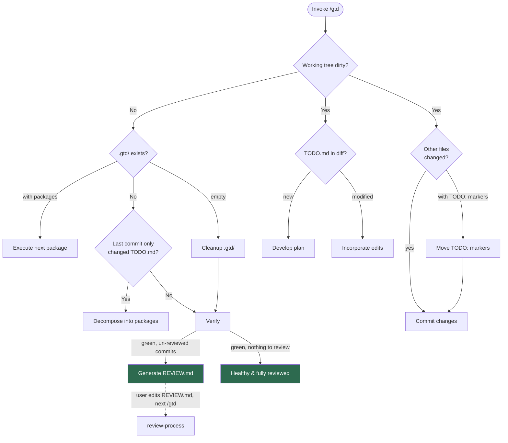

# gi[t]hings.**done**

> [!WARNING]
> This project is an experiment in unapologetic vibe coding. Code might be
> terrible, I don't even know 🤷‍♂️ But otherwise I wouldn't have built it in the
> first place. Now I have something that actually helps me.

A git-aware agent skill that emits the next prompt for an autonomous coding
agent based on the current working-tree state — plan, refine the plan,
decompose into work packages, execute with parallel subagents, commit, or
verify the working tree is healthy.

`gtd` ships as an [Agent Skills Spec](https://agentskills.io/specification)
compliant skill installable via [skills.sh](https://www.skills.sh/). The
agent runs the bundled script, reads the emitted prompt, and follows it
verbatim.

## Installation

```bash
npx skills add pmelab/gtd -g -y
```

That's it. No npm install, no config file, no setup subcommand. The skill
bundles its own prebuilt script.

## Usage

Inside the agent (Claude Code, Codex, etc.), either:

- Type `/gtd` to invoke the skill directly, **or**
- Say something like "take the next step", "what's next", or "gtd" — the
  skill's description matcher picks it up.

The agent runs `node scripts/gtd.js` in your current working directory and
acts on the emitted prompt.

## What it does

`gtd` reads the current git state and composes the prompt from a fixed set of
task sections. Multiple sections can fire in the same run — for example, new
`TODO:` markers in code compose with the "group and commit" task.

| State                                                  | Section emitted                              |
| ------------------------------------------------------ | -------------------------------------------- |
| New (untracked / added) `TODO.md`                      | Develop the plan (planning model)            |
| Modified `TODO.md`                                     | Incorporate edits, keep developing (planning)|
| Clean tree, last commit touched only `TODO.md`, no `.gtd/` | Decompose into work packages (planning)  |
| `.gtd/` exists with packages                           | Execute next package (execution model)       |
| `.gtd/` exists but empty                               | Cleanup, then verify                         |
| Uncommitted code changes outside `TODO.md`             | Commit the uncommitted changes               |
| Added/modified lines containing `TODO:` markers        | Move `TODO:` markers into `TODO.md`          |
| Clean tree, no `.gtd/`, last commit was not `TODO.md`, un-reviewed commits exist | Verify, then generate `REVIEW.md` (human-review) |
| Clean tree, no `.gtd/`, last commit was not `TODO.md`, nothing to review | Verify the working tree is healthy (verified) |

> **Review base**: the closest-to-HEAD of {parent-branch merge-base, last
> `<!-- base: … -->` review commit}. When no base exists, nothing to review.

gtd coordinates phases — it doesn't dictate strategy. How to grill, how to
commit, how to build, how to verify: those are left to other skills (or the
agent's own judgement). The prompts only describe **intent**, plus the
`TODO.md` and `.gtd/` plumbing that lets phases bridge across runs.

Every prompt also includes the current `git diff HEAD` (untracked files
included) inline.

## Model configuration

gtd uses two model tiers, configured in your `~/.pi/AGENTS.md`:

```markdown
## Model preferences

- Use Claude Opus for planning work
- Use Claude Sonnet for execution work
```

- **Planning model**: High-reasoning for developing plans, grilling, and
  decomposing work packages
- **Execution model**: Everyday work for implementing tasks, running tests,
  fixing failures

If no preferences are set, the prompts include sensible defaults.

## Workflow


```mermaid
flowchart TD
    Start([Invoke /gtd]) --> Dirty{Working tree dirty?}
    Dirty -->|No| Gtd{.gtd/ exists?}
    Gtd -->|with packages| Execute[Execute next package]
    Gtd -->|empty| Cleanup[Cleanup .gtd/]
    Gtd -->|No| Last{Last commit only<br/>changed TODO.md?}
    Last -->|Yes| Decompose[Decompose into packages]
    Last -->|No| Verify[Verify]
    Dirty -->|Yes| Todo{TODO.md in diff?}
    Todo -->|new| Seed[Develop plan]
    Todo -->|modified| Refine[Incorporate edits]
    Dirty -->|Yes| Other{Other files<br/>changed?}
    Other -->|with TODO: markers| Markers[Move TODO: markers]
    Other -->|yes| Commit[Commit changes]
    Markers --> Commit
    Cleanup --> Verify
    Verify -->|green, un-reviewed commits| HumanReview[Generate REVIEW.md]:::terminal
    Verify -->|green, nothing to review| Verified[Healthy & fully reviewed]:::terminal
    HumanReview -.->|user edits REVIEW.md, next /gtd| ReviewProcess[review-process]
    classDef terminal fill:#2d6a4f,color:#fff
```

A typical feature:

1. Create a `TODO.md` with a sketch of what you want.
2. `/gtd` — the agent (using the planning model) fleshes it out, appends an
   `## Open Questions` section, and commits `TODO.md`.
3. Open `TODO.md`, write inline answers under each question.
4. `/gtd` again — the agent integrates your answers, moves resolved
   questions to `## Answered Questions`, raises new ones, and commits.
   Repeat until `## Open Questions` is empty.
5. `/gtd` once more — agent decomposes `TODO.md` into work packages in
   `.gtd/`, deletes `TODO.md`, and commits the plan.
6. `/gtd` again — agent executes the first package: spawns parallel workers
   (execution model + TDD), runs tests, fixes failures, commits.
7. Repeat `/gtd` for each remaining package.
8. When `.gtd/` is empty, `/gtd` cleans up and verifies. After tests pass,
   if un-reviewed commits exist relative to the base (parent-branch merge-base
   or last review commit), it auto-generates `REVIEW.md` and stops for you to
   review it (human-review). If everything is already reviewed, it reports the
   tree healthy and fully reviewed (verified).

## Build orchestration

When a plan is finalized, gtd enters build mode:

### 1. Decompose

A planning-model subagent breaks `TODO.md` into executable work packages:

```
.gtd/
  01-auth-module/
    01-define-types.md
    02-implement-login.md
    COMMIT_MSG.md
  02-api-endpoints/
    01-create-routes.md
    02-add-middleware.md
    COMMIT_MSG.md
```

Rules:
- **Packages are sequential** — Package 02 cannot start until 01 is complete
- **Tasks within a package are parallel** — No dependencies between tasks
- **Task files are self-contained** — Include description, acceptance criteria,
  relevant file paths

### 2. Execute

For each package:

1. Spawn parallel execution-model workers for all tasks (with `tdd` skill)
2. If any worker fails: ask user to retry/skip/abort
3. Spawn a testing subagent to run tests and fix failures
4. If tests fail after max retries: ask user how to proceed
5. Delete package directory, commit with `COMMIT_MSG.md`

### 3. Cleanup

Remove empty `.gtd/`, verify working tree is healthy.

## Q&A format inside TODO.md

The `## Open Questions` section lives at the TOP of TODO.md (before the plan
body). Each question looks like this:

```markdown
### What should pagination default to?

**Recommendation:** 25 per page — matches the admin tables elsewhere.

<!-- user answers here -->
```

To answer, replace the comment with your response:

```markdown
### What should pagination default to?

**Recommendation:** 25 per page — matches the admin tables elsewhere.

50 — these tables get long and 25 wastes a click for most users.
```

On the next run, the agent integrates the answer into the plan body and moves
the question to `## Answered Questions` at the bottom:

```markdown
## Answered Questions

### What should pagination default to?

**Recommendation:** 25 per page — matches the admin tables elsewhere.

**Answer:** 50 — these tables get long and 25 wastes a click for most users.
```

This preserves the decision history for future reference.

## Formatting

gtd ships a `format` subcommand that formats a markdown file in place:

```bash
node scripts/gtd.js format <file>
```

It uses a bundled prettier with a fixed, gtd-owned config (`parser: "markdown"`,
`printWidth: 80`, `proseWrap: "always"`). The host repo's `.prettierrc` is
**intentionally ignored** — determinism across consumer repos matters more than
local style preferences.

The main gtd prompt instructs the agent to invoke this command after every edit
to `TODO.md` or `REVIEW.md`, so those files stay consistently formatted
regardless of the host project's toolchain.

> [!NOTE]
> Upgrading gtd may reflow existing `TODO.md` files if the bundled prettier
> major version changes.

## Development

```bash
npm install
npm run build        # tsup → scripts/gtd.js (checked in)
npm test             # vitest
npm run test:e2e     # cucumber integration tests
npm run typecheck
npm run lint
```

`scripts/gtd.js` is committed to the repo so the skill installs zero-step.
Rebuild it before tagging a release.

## License

MIT
