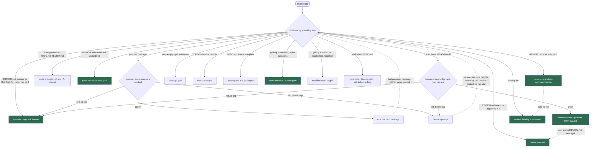

# gi[t]hings.**done**

> [!WARNING] This project is an experiment in unapologetic vibe coding. Code
> might be terrible, I don't even know 🤷‍♂️ But otherwise I wouldn't have built it
> in the first place. Now I have something that actually helps me.

A git-aware agent skill that emits the next prompt for an autonomous coding
agent based on the current repository state — plan, refine the plan, decompose
into work packages, execute with parallel subagents, commit, or verify the
working tree is healthy.

Internally, gtd is an [xstate](https://stately.ai/docs/xstate) event-sourced
state machine used as a **pure fold** over git history. The Effect "edge"
(`src/Events.ts`) reads the first-parent commit subjects since the merge-base
with the default branch (whole-history fallback when there is no default branch
or merge-base) plus the working tree, turns them into a `COMMIT[]` + single
`RESOLVE` event stream, and folds them through the IO-free machine
(`src/Machine.ts`). The fold lands on exactly **one** active leaf state, which
selects the prompt. There is no multi-section/branches-array snapshot — a single
run resolves to a single state.

`gtd` ships as an [Agent Skills Spec](https://agentskills.io/specification)
compliant skill installable via [skills.sh](https://www.skills.sh/). The agent
runs the bundled script, reads the emitted prompt, and follows it verbatim.

## Installation

```bash
npx skills add pmelab/gtd -g -y
```

That's it. No npm install, no config file, no setup subcommand. The skill
bundles its own prebuilt script.

## Usage

Inside the agent (Claude Code, Codex, etc.), either:

- Type `/gtd` to invoke the skill directly, **or**
- Say something like "take the next step", "what's next", or "gtd" — the skill's
  description matcher picks it up.

The agent runs `node scripts/gtd.js` in your current working directory and acts
on the emitted prompt.

## What it does

`gtd` folds git history + the working tree into a single active leaf state and
emits the one prompt for that state. The guards are evaluated in a fixed
priority order, so exactly one state wins per run:

Planning state is driven by `TODO.md`'s `status:` frontmatter (`grilling` /
`complete` / `simple`) — the in-file marker is the source of truth — and human
changes are always committed verbatim **first**, before any gate is evaluated.

| Leaf state       | When it wins (first matching guard, top to bottom)                                              | Prompt                                                                                                                                                                                       |
| ---------------- | ----------------------------------------------------------------------------------------------- | -------------------------------------------------------------------------------------------------------------------------------------------------------------------------------------------- |
| `escalate`       | A committed `ERRORS.md` is present, OR the trailing run of `Gtd-Test-Fix:`-trailer commits hit the cap | Stop; surface the failure, keep `ERRORS.md` as the human gate                                                                                                                                |
| `close-review`   | `REVIEW.md` dirty with ONLY forward checkbox ticks, nothing else, **and no `!!` comment**       | Discard ticks, delete `REVIEW.md`, commit the close                                                                                                                                          |
| `code-changes`   | Any uncommitted change outside `TODO.md` **and** `REVIEW.md` (verbatim-first)                   | Commit everything with `git add -A` (leaving `TODO.md` for the planning phase)                                                                                                               |
| `review-process` | `REVIEW.md` dirty with notes/ticks (no outside code), or an approved review with a `!!` comment | Commit raw feedback verbatim, then synthesize `TODO.md`; harvest `!!` comments (not plain `TODO:`)                                                                                            |
| `await-review`   | `REVIEW.md` committed and unmodified (no feedback yet)                                           | Human gate — wait for the reviewer to work through `REVIEW.md`; **STOP**                                                                                                                      |
| `execute`        | `.gtd/` contains numbered work packages                                                         | Edge runs `npm run test` first; on green, name the single next package and inline its tasks (one subagent per task); on the last package also remove `.gtd/`; on red, fix-tests (or escalate) |
| `cleanup`        | `.gtd/` exists but holds no packages                                                            | Remove empty `.gtd/`, then verify — vestigial safety net                                                                                                                                     |
| `execute-simple` | `TODO.md` `status: simple` (≤5 files), or legacy `<!-- simple -->`                              | Implement the simple plan directly, no decomposition                                                                                                                                         |
| `decompose`      | `TODO.md` `status: complete`                                                                     | Record `TODO.md`, then decompose into ordinal, dependency-ordered packages                                                                                                  |
| `await-answers`  | `TODO.md` `status: grilling`, committed, with open questions remaining                          | Human gate — wait for the user to answer the open questions; **STOP**                                                                                                                         |
| `modified-todo`  | `TODO.md` `status: grilling` and edited, or a markerless `TODO.md` modified in place            | Incorporate edits, re-grill, move resolved Q&A to `## Resolved`, set `status:` when done                                                                                                     |
| `new-todo`       | A markerless `TODO.md` (fresh sketch), committed or newly added                                 | Develop the plan: add `## Open Questions`, set `status: grilling`                                                                                                           |
| `human-review`   | Clean tree, a review base exists, and `base..HEAD` has a non-empty diff                         | Edge runs `npm run test`; on green generate `REVIEW.md`, on red fix-tests (or escalate)                                                                                                      |
| `verified`       | Nothing else matched — tree clean, nothing left to review                                       | Report the working tree healthy and reviewed                                                                                                                                                 |

> **`fix-tests` is a prompt, not a leaf state.** It is never one of the
> machine's resolved leaf states — it is selected in the Effect edge (keyed off
> the resolved leaf + the test exit code) when the hardcoded `npm run test`
> fails on the `human-review` or `execute` path. It embeds the captured failure
> output and instructs the agent to make exactly ONE `fix(gtd): <desc>` commit
> (with a `Gtd-Test-Fix: <n>` trailer), then re-run gtd so the gate re-evaluates.

> **Review base**: the closest-to-HEAD of {parent-branch merge-base, last
> `<!-- base: … -->` review commit, last `chore(gtd): close approved review`
> commit}, restricted to ancestors of HEAD. When no base exists or `base..HEAD`
> is empty, there is nothing to review. Because the close commit itself becomes
> the new base, the run immediately after a close resolves to `verified`.

> **Test-fix loop**: the fix-tests prompt drives an internal loop — read the
> uncommitted `ERRORS.md` attempt log, make one fix, re-run, append the attempt,
> repeat up to **3** (the hardcoded `MAX_VERIFY_ITERATIONS` — **not** overridable
> via `.gtdrc`). Nothing is committed per attempt; only on success (a single
> `fix(gtd): <desc>` commit carrying a `Gtd-Test-Fix: <n>` trailer, `ERRORS.md`
> discarded) or on escalation (`ERRORS.md` committed as the human gate). The
> trailing run of commits carrying a `Gtd-Test-Fix:` trailer at HEAD is counted in
> the Effect edge; reaching the cap, a recurring failure signature, or a committed
> `ERRORS.md` all resolve to `escalate`. Any commit WITHOUT a `Gtd-Test-Fix:`
> trailer resets the counter to 0; deleting `ERRORS.md` clears the gate.
> `src/Machine.ts` stays pure/IO-free.

> **Deterministic test execution**: when the fold lands on `human-review` or
> `execute`, gtd runs the test suite **itself** in the Effect edge — not the
> agent. It spawns the configured `testCommand` (defaults to `npm run test`; see
> [Configuration](#configuration)), captures stdout + stderr + the exit code, and
> branches the emitted
> prompt on the result: a green run (exit 0) emits the leaf's normal prompt
> (`REVIEW.md` generation / execute the next package); a red run emits the
> `fix-tests` prompt with the captured output embedded (or `escalate` once the
> cap is reached). The fold in `src/Machine.ts` stays pure — the actual test run
> lives only in the edge.

> **`!!` follow-up comments** (a comment whose body begins with `!!`, in any
> language — `// !!`, `# !!`, `<!-- !!`) are leftover work. They are harvested
> verbatim into `TODO.md` during `review-process`; their presence also diverts
> an otherwise-approved review away from `close-review`. Harvesting is
> **scoped to the reviewer's session**: only `!!` tokens on lines *added* since
> the `review(gtd): create review …` commit (the review baseline) are
> harvested, regardless of which files `REVIEW.md` references — pre-existing
> `!!` anywhere in the tree are ignored. Harvest is **read-only** — the comment
> is captured verbatim into `TODO.md` but is not stripped from the source (the
> reviewer's edits reach `review-process` already committed, since `code-changes`
> runs first). Plain `TODO:` markers are ordinary code and are never swept up.

gtd coordinates phases — it doesn't dictate strategy. How to grill, how to
commit, how to build, how to verify: those are left to other skills (or the
agent's own judgement). The prompts only describe **intent**, plus the `TODO.md`
and `.gtd/` plumbing that lets phases bridge across runs.

Every prompt also includes the current `git diff HEAD` (untracked files
included) inline.

## Configuration

gtd reads an optional `.gtdrc` config file via
[cosmiconfig](https://github.com/cosmiconfig/cosmiconfig). With no config, the
built-in defaults apply. Supported filenames (searched in this order):

- `.gtdrc`
- `.gtdrc.json`
- `.gtdrc.yaml`
- `.gtdrc.yml`
- `gtd.config.json`
- `gtd.config.yaml`

### Schema

- **`testCommand`** (string) — the command gtd runs in the Effect edge to verify
  the `human-review` and `execute` paths. Previously hardcoded to `npm run test`;
  now overridable. (The per-edge test-fix cap — `MAX_VERIFY_ITERATIONS` — stays
  fixed and is **not** overridable.)
- **`models`** — model selection for subagent-spawning states:
  - `planning` — high-reasoning model for developing plans, grilling, and
    decomposing work packages.
  - `execution` — everyday model for implementing tasks, running tests, fixing
    failures.
  - `states.*` — per-state overrides for the 5 subagent-spawning states:
    `new-todo`, `modified-todo`, `decompose`, `execute`, `execute-simple`.
    Unknown `models.states` keys (e.g. `fix-tests`) are **rejected**.

### Defaults (no config)

- `testCommand`: `npm run test`
- `models.planning`: `claude-opus-4-8`
- `models.execution`: `claude-sonnet-4-8`

### Lookup and precedence

gtd walks from the current working directory **up to your home directory** (or
to the filesystem root when cwd is outside home), collecting every `.gtdrc` it
finds along the way. All found levels are **merged**, with the **innermost (cwd)
config winning** on conflicts.

This makes the worktree-parent case easy: drop a single `.gtdrc` in a shared
parent directory and it cascades to **all** checkouts/worktrees beneath it,
while any individual checkout can still override settings with its own `.gtdrc`.

### Example

```yaml
# .gtdrc.yaml
testCommand: pnpm test
models:
  planning: claude-opus-4-8
  execution: claude-sonnet-4-8
  states:
    decompose: claude-opus-4-8
    execute: claude-sonnet-4-8
```

## Workflow

The machine evaluates guards in priority order and resolves to a single leaf
state per run:


```mermaid
flowchart TD
    Start([Invoke /gtd]) --> Resolve{Fold history + working tree}
    Resolve -->|"ERRORS.md present or Gtd-Test-Fix: trailer run hit 3"| Escalate[escalate: stop, ask human]:::terminal
    Resolve -->|REVIEW.md ticks only, no !!| CloseReview[close-review: close approved review]:::terminal
    Resolve -->|change outside TODO.md/REVIEW.md| CodeChanges[code-changes: git add -A, commit]
    Resolve -->|REVIEW.md notes, or approved + !!| ReviewProcess[review-process]:::terminal
    Resolve -->|REVIEW.md committed, unmodified| AwaitReview[await-review: human gate]:::terminal
    Resolve -->|.gtd/ has packages| ExecuteTest{execute: edge runs npm run test}
    ExecuteTest -->|green| Execute[execute next package]
    ExecuteTest -->|red, below cap| FixTests[fix-tests prompt]
    ExecuteTest -->|red, at cap| Escalate
    Execute -.->|last package: removes .gtd/ in same commit| Resolve
    Resolve -->|stray empty .gtd/ safety net| Cleanup[cleanup .gtd/]
    Resolve -->|TODO.md status: simple| ExecuteSimple[execute-simple]
    Resolve -->|TODO.md status: complete| Decompose[decompose into packages]
    Resolve -->|grilling, committed, open questions| AwaitAnswers[await-answers: human gate]:::terminal
    Resolve -->|grilling + edited, or markerless modified| ModifiedTodo[modified-todo: re-grill]
    Resolve -->|markerless TODO.md| NewTodo[new-todo: develop plan, set status: grilling]
    Resolve -->|clean, base..HEAD has diff| HumanReviewTest{human-review: edge runs npm run test}
    HumanReviewTest -->|green| HumanReview[human-review: generate REVIEW.md]:::terminal
    HumanReviewTest -->|red, below cap| FixTests
    HumanReviewTest -->|red, at cap| Escalate
    Resolve -->|nothing left| Verified[verified: healthy & reviewed]:::terminal
    FixTests -.->|"on success: one fix(gtd): commit (Gtd-Test-Fix: trailer), re-run /gtd"| Resolve
    HumanReview -.->|user works REVIEW.md, next /gtd| ReviewProcess
    CloseReview -.->|auto re-run| Verified
    classDef terminal fill:#2d6a4f,color:#fff
```

A typical feature:

1. Create a `TODO.md` with a sketch of what you want.
2. `/gtd` — the agent (using the planning model) fleshes it out, adds
   `status: grilling` frontmatter, appends an `## Open Questions` section, and
   commits `TODO.md`. The next run is a human gate (`await-answers`) until you
   answer.
3. Open `TODO.md`, write inline answers under each question.
4. `/gtd` again — the agent integrates your answers, moves resolved questions to
   the `## Resolved` graveyard, raises new ones, and commits. When no questions
   remain it sets `status: simple` (≤5 files) or `status: complete`. Repeat until
   the status is set.
5. `/gtd` once more — agent first records `TODO.md` as
   `docs(plan): record TODO.md` (when not already in `HEAD`, preserving the plan
   and its Q&A history), then decomposes it into work packages in `.gtd/`,
   deletes `TODO.md`, and commits the plan.
6. `/gtd` again — first the edge runs `npm run test` (green or, on the first
   package, nothing to verify yet); on green the prompt names the single next
   package and inlines its task contents, and the agent executes it: spawns
   parallel workers (execution model + TDD), commits with `COMMIT_MSG.md`,
   deletes the package directory. It does **not** run tests in-prompt — the next
   cycle's edge runs `npm run test` to verify the package just committed.
7. Repeat `/gtd` for each remaining package — one package per cycle, each
   cycle's edge verifying the previous commit. A red test run emits the
   fix-tests prompt (one `fix(gtd):` fix per cycle, each carrying a
   `Gtd-Test-Fix:` trailer) until green or the cap
   escalates. On the **last** package the execute prompt also removes the empty
   `.gtd/` in the same commit, so cleanup is normally skipped.
8. With `.gtd/` already gone, the next `/gtd` proceeds straight to human-review
   (the `cleanup` step survives only as a safety net for a stray empty `.gtd/`).
   If un-reviewed commits exist relative to the base (parent-branch merge-base
   or last review commit), it resolves to human-review and **runs the test suite
   itself**: on green it auto-generates `REVIEW.md` and stops for you to review
   it; on red it emits the fix-tests prompt (one `fix(gtd): <desc>` commit per
   cycle carrying a `Gtd-Test-Fix:` trailer) or, once the iteration cap is
   reached, `escalate`. If everything
   is already reviewed, it reports the tree healthy and fully reviewed
   (verified).
9. Work `REVIEW.md` (tick boxes, leave notes, edit source, drop `!!` comments)
   and run `/gtd`. Any change outside `REVIEW.md`/`TODO.md` is committed verbatim
   first (`code-changes`). A pure-tick approval with nothing left over closes the
   review (`close-review`); notes or `!!` comments fold your feedback into a
   fresh `TODO.md` (`review-process`, harvesting `!!` tokens on lines added
   since the review baseline commit, regardless of file membership), and the
   loop starts over.

> If the test gate keeps failing, the fix-tests prompt loops internally up to
> **3** attempts, tracking what was tried in an uncommitted `ERRORS.md`, and only
> commits on success (`fix(gtd): <desc>` with a `Gtd-Test-Fix:` trailer) or
> escalation (`ERRORS.md` committed). The counted signal is the trailing run of
> commits carrying a `Gtd-Test-Fix:` trailer at HEAD. Reaching the cap, a
> recurring failure signature, or a committed `ERRORS.md` all resolve to
> `escalate`. Any commit without a `Gtd-Test-Fix:` trailer resets the counter to
> 0; delete `ERRORS.md` to clear the gate.
>
> **BC note (upgrading mid-flight):** existing loops that have old markerless
> `fix(gtd):` test-fix commits in history (before this change) may run up to 2
> extra test-fix attempts in the current loop once, because those commits no
> longer carry the trailer and therefore stop counting. There is no code
> fallback. This is strictly safer — it can never escalate a green or
> recoverable build early — and it never masks a real `ERRORS.md` escalation,
> which is an independent guard.

## Build orchestration

When a plan is finalized, gtd enters build mode:

### 1. Decompose

Before decomposing, if `TODO.md` is not already committed and unchanged at
`HEAD`, it is recorded verbatim as `docs(plan): record TODO.md` — preserving the
plan and its full Q&A history (`## Open Questions` / `## Resolved`) in git
history before deletion. In the normal flow this is a no-op (the plan was
already committed by `new-todo`/`modified-todo`); it only fires when a fresh,
never-committed `TODO.md` is routed directly to decompose.

A planning-model subagent then breaks `TODO.md` into executable work packages:

```
.gtd/
  01-auth-module/
    01-define-types.md
    02-implement-login.md
    COMMIT_MSG.md
  02-api-endpoints/
    01-create-routes.md
    02-add-middleware.md
    COMMIT_MSG.md
```

Rules:

- **Packages are sequential, in ordinal dependency order** — `01-`, `02-`, …;
  the set is frozen once written (no re-decomposition). Package 02 cannot start
  until 01 is complete.
- **Each package is green on its own** — the test suite runs after every
  package, so none may leave the tree red for a later package to fix.
- **Tasks within a package are parallel and file-disjoint** — one subagent per
  task, no isolation; tasks that would touch the same file are merged into one.
- **Task files are self-contained** — Include description, acceptance criteria,
  relevant file paths

### 2. Execute

Execution is **one package per cycle**. gtd selects the single next package
itself, NAMES it in the prompt, and inlines its task files' full contents
directly into the emitted prompt (noting its `COMMIT_MSG.md`) — the prompt is
self-contained, so the agent never browses `.gtd/` or picks a package.
Verification is deterministic and lives in the edge, not in the prompt: before
any execute prompt is emitted the edge runs `npm run test`, and the cycle that
follows a package commit re-runs it to verify that commit.

On the **last** package, the execute prompt also instructs removing the
now-empty `.gtd/` directory in the **same** commit, so the next run proceeds
straight to `human-review` — the `cleanup` round-trip is normally skipped.

A single execute cycle (green test gate):

1. Spawn parallel execution-model workers for all tasks in the selected package
   (with `tdd` skill)
2. If any worker fails (crash/timeout, not a test failure): ask user to
   retry/skip/abort
3. Commit all changes with `COMMIT_MSG.md`, then delete the package directory.
   Do **not** run or determine a test command here.
4. Re-run gtd — the next cycle's edge runs `npm run test` to verify what was
   just committed, then advances to the next package.

When that edge test run fails, the edge emits the `fix-tests` prompt instead:
loop internally up to three attempts (tracked in an uncommitted `ERRORS.md`),
committing only on success (`fix(gtd): <desc>` with a `Gtd-Test-Fix:` trailer)
or escalation. Three consecutive commits carrying a `Gtd-Test-Fix:` trailer, a
recurring failure signature, or a committed `ERRORS.md` resolve to `escalate`
and hand control back to the human.

### 3. Cleanup

Remove empty `.gtd/`, verify working tree is healthy. This step is now a
**vestigial safety net**: the normal tail no longer reaches it, because the last
execute package removes the empty `.gtd/` in its own commit (see above). It is
retained only to catch a stray empty `.gtd/` — e.g. one created by hand — so the
machine still has a defined transition for that case.

## Q&A format inside TODO.md

`TODO.md` carries a `status:` frontmatter field that drives the planning phase:
`grilling` while questions remain, then `simple` (≤5 files) or `complete` once
resolved:

```markdown
---
status: grilling
---
```

The `## Open Questions` section lives at the TOP of TODO.md (below the
frontmatter, before the plan body). Each question looks like this:

```markdown
### What should pagination default to?

**Recommendation:** 25 per page — matches the admin tables elsewhere.

<!-- user answers here -->
```

To answer, replace the comment with your response:

```markdown
### What should pagination default to?

**Recommendation:** 25 per page — matches the admin tables elsewhere.

50 — these tables get long and 25 wastes a click for most users.
```

On the next run, the agent integrates the answer into the plan body and moves
the question to the `## Resolved` graveyard at the bottom:

```markdown
## Resolved

### What should pagination default to?

**Recommendation:** 25 per page — matches the admin tables elsewhere.

**Answer:** 50 — these tables get long and 25 wastes a click for most users.
```

This preserves the decision history for future reference.

## Formatting

gtd ships a `format` subcommand that formats a markdown file in place:

```bash
node scripts/gtd.js format <file>
```

It uses a bundled prettier with a fixed, gtd-owned config (`parser: "markdown"`,
`printWidth: 80`, `proseWrap: "always"`). The host repo's `.prettierrc` is
**intentionally ignored** — determinism across consumer repos matters more than
local style preferences.

The main gtd prompt instructs the agent to invoke this command after every edit
to `TODO.md` or `REVIEW.md`, so those files stay consistently formatted
regardless of the host project's toolchain.

> [!NOTE] Upgrading gtd may reflow existing `TODO.md` files if the bundled
> prettier major version changes.

## Development

```bash
npm install
npm run dev          # run from source, no build (node dev/run.mjs)
npm run build        # tsup → scripts/gtd.js (checked in)
npm test             # vitest
npm run test:e2e     # cucumber integration tests
npm run typecheck
npm run lint
```

`npm run dev` runs `src/main.ts` directly via Node's native TypeScript
type-stripping (requires Node 22.6+). It registers `dev/hooks.mjs`, which fills
the two gaps the tsup build otherwise covers: resolving `./Foo.js` specifiers to
the on-disk `./Foo.ts`, and importing `*.md` prompt files as text. Pass CLI args
after `--`, e.g. `npm run dev -- format <file>`. The helpers live in `dev/`
rather than `scripts/` because tsup wipes `scripts/` (`clean: true`) on build.

`scripts/gtd.js` is committed to the repo so the skill installs zero-step.
Rebuild it before tagging a release.

## License

MIT
