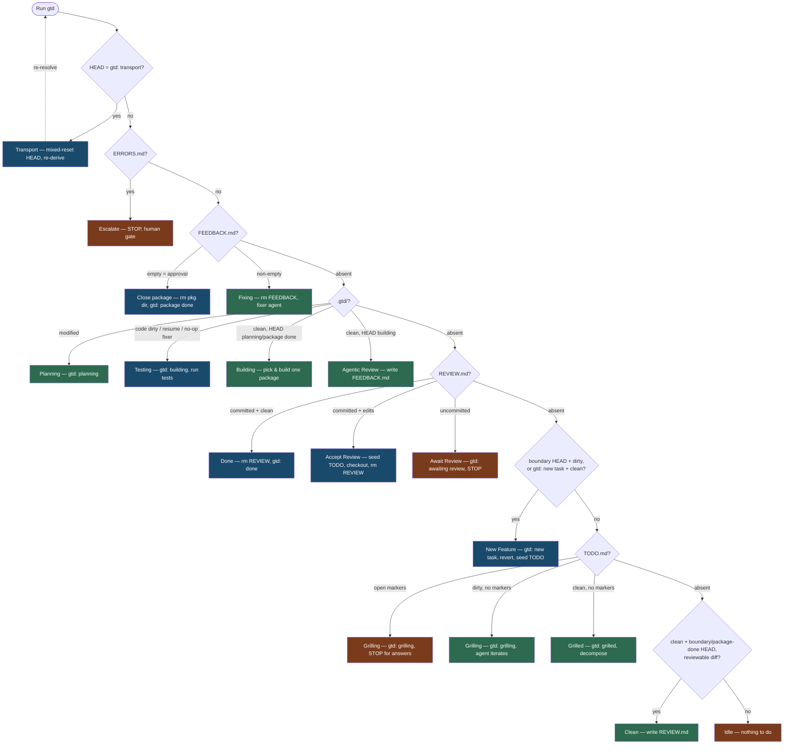

# gi[t]hings.**done**

> [!WARNING] This project is an experiment in unapologetic vibe coding. Code
> might be terrible, I don't even know 🤷‍♂️ But otherwise I wouldn't have built it
> in the first place. Now I have something that actually helps me.

A git-aware agent skill that emits the next prompt for an autonomous coding
agent based on the current repository state — capture an idea, grill it into a
plan, decompose it into work packages, execute with parallel subagents, test,
agentically review each package, and finally walk a human through a review.

Internally, gtd is a **pure fold** over git history. The decision core
(`src/Machine.ts`) is a single IO-free function, `resolve(events)` — **no
xstate, no actor, no Effect**. The Effect "edge" (`src/Events.ts`) does all the
git/filesystem IO: it reads the **first-parent** commit subjects since the
merge-base with the default branch (whole-history fallback when there is no
default branch or merge-base) plus the working tree, turns them into a
`COMMIT[]` + single terminal `RESOLVE` event stream, and folds them through the
machine. The fold lands on exactly **one** of 16 states, which selects the
prompt. A single run resolves to a single state.

`resolve()` returns that state plus an optional **`EdgeAction`** (a commit,
revert, test run, or file write). The driver loop (`src/main.ts`) performs the
action, then re-gathers and re-resolves — auto-advancing through the
deterministic chain **within one invocation** until it reaches a prompt-bearing
or STOP state. The agent never runs `git commit` itself: every agent leaves its
output **uncommitted**, and the edge commits it with the right flat `gtd:
<phase>` subject on the next hop. The machine stays pure — it only decides
*which* action; the semantics live in the edge.

`gtd` ships as an [Agent Skills Spec](https://agentskills.io/specification)
compliant skill installable via [skills.sh](https://www.skills.sh/). The agent
runs the bundled script, reads the emitted prompt, and follows it verbatim.

## Installation

```bash
npx skills add pmelab/gtd -g -y
```

That's it. No npm install, no config file, no setup subcommand. The skill
bundles its own prebuilt script.

## Usage

Inside the agent (Claude Code, Codex, etc.), either:

- Type `/gtd` to invoke the skill directly, **or**
- Say something like "take the next step", "what's next", or "gtd" — the skill's
  description matcher picks it up.

The agent runs `node scripts/gtd.js` in your current working directory and acts
on the emitted prompt. The script takes **no ref argument** — the review base is
always auto-computed.

## Steering files

`gtd` writes and commits temporary steering files that carry workflow state
across runs:

- **TODO.md** — the current plan, under development during grilling.
- **REVIEW.md** — a guided human review with file pointers spanning a commit
  diff.
- **FEEDBACK.md** — test-failure output, **or** agentic-review findings, to be
  fixed. An **empty** FEEDBACK.md from a clean agentic review signals
  **approval** (→ Close package).
- **ERRORS.md** — the escalation gate: persistent test-failure output that stops
  the loop for a human (written instead of FEEDBACK.md once the fix-attempt cap
  is hit; never auto-consumed).
- **.gtd/** — ordered work packages (one numbered directory each) of
  parallelizable subtasks.

Steering files are **authoritative**: while any exist, `gtd` resumes that
workflow regardless of the last commit (even a non-gtd one). They are **never
garbage-collected automatically** — a stale steering file from an abandoned
branch is resumed exactly like a live one, so you must `rm` files from a workflow
you have abandoned.

"**Code changes**" below means pending working-tree changes (tracked or
untracked, respecting `.gitignore`) **outside** the steering set. Changes to
steering files are detected separately.

## Detection model

Every run derives the state in **three layers**:

1. **Transport pre-pass** — if HEAD is `gtd: transport`, short-circuit to the
   Transport state (mixed-reset) before anything else is considered.
2. **Steering-file precedence** — the presence of `ERRORS.md` / `FEEDBACK.md` /
   `.gtd/` / `REVIEW.md` drives the decision, authoritative regardless of HEAD.
3. **HEAD bucket** — with no steering files in play, the last-commit bucket plus
   working-tree cleanliness selects New Feature / Grilling / Clean / Idle.

Within layers 2 and 3 the HEAD subject further disambiguates states the
filesystem alone cannot separate (e.g. inside the `.gtd/` lifecycle, HEAD `gtd:
planning` vs `gtd: building` vs `gtd: package done`).

### Commit taxonomy

`gtd` writes a single **flat** `gtd: <phase>` subject for every workflow commit.
The complete set:

`gtd: new task` · `gtd: grilling` · `gtd: grilled` · `gtd: planning` · `gtd:
building` · `gtd: errors` · `gtd: feedback` · `gtd: fixing` · `gtd: package
done` · `gtd: awaiting review` · `gtd: done` — plus the hand-made `gtd:
transport` (see below).

The last commit subject is bucketed two ways:

- **Boundary** — a non-`gtd:` commit, or exactly `gtd: done`. Marks a cold
  start: no workflow in progress.
- **Mid-phase** — any other `gtd: <phase>` subject. Identifies the exact phase of
  an in-progress workflow.

### Precedence ladder (first match wins)

0. **HEAD `gtd: transport`** → Transport.
1. **ERRORS.md present** → Escalate (human gate; STOP).
2. **FEEDBACK.md present** → non-empty → Fixing; **empty** (clean agentic review
   = approval) → Close package.
3. **.gtd present** → build lifecycle, routed by tree + HEAD:
   - `.gtd` modified (package files added/edited) → Planning
   - code changes present → Testing
   - clean tree + HEAD `gtd: fixing` (no-op fixer) → Testing (re-test)
   - else clean, by HEAD: `gtd: planning` / `gtd: package done` → Building; `gtd:
     building` → Agentic Review (or Close package, if force-approved)
4. **REVIEW.md present** → review lifecycle, routed by committed-ness + tree:
   committed + clean → Done; committed + pending edits → Accept Review;
   uncommitted → Await Review.
5. **Boundary HEAD + pending changes** (and no `.gtd`/REVIEW/FEEDBACK), or HEAD
   `gtd: new task` + clean tree (regenerate a lost seed) → New Feature.
6. **TODO.md present** → Grilling / Grilled.
7. **Boundary or `gtd: package done` HEAD + clean tree** → Clean (review the
   work) or Idle (nothing to review).

Anything matching no rule is corruption — `gtd` **hard-errors** rather than
guess.


```mermaid
flowchart TD
    Start([Run gtd]) --> P0{"HEAD = gtd: transport?"}
    P0 -->|yes| Transport["Transport — mixed-reset HEAD, re-derive"]:::edge
    Transport -.->|re-resolve| Start
    P0 -->|no| P1{"ERRORS.md?"}
    P1 -->|yes| Escalate["Escalate — STOP, human gate"]:::gate
    P1 -->|no| P2{"FEEDBACK.md?"}
    P2 -->|"empty = approval"| Close["Close package — rm pkg dir, gtd: package done"]:::edge
    P2 -->|"non-empty"| Fixing["Fixing — rm FEEDBACK, fixer agent"]:::agent
    P2 -->|absent| P3{".gtd/?"}
    P3 -->|"modified"| Planning["Planning — gtd: planning"]:::agent
    P3 -->|"code dirty / resume / no-op fixer"| Testing["Testing — gtd: building, run tests"]:::edge
    P3 -->|"clean, HEAD planning/package done"| Building["Building — pick & build one package"]:::agent
    P3 -->|"clean, HEAD building"| Review["Agentic Review — write FEEDBACK.md"]:::agent
    P3 -->|absent| P4{"REVIEW.md?"}
    P4 -->|"committed + clean"| Done["Done — rm REVIEW, gtd: done"]:::edge
    P4 -->|"committed + edits"| Accept["Accept Review — seed TODO, checkout, rm REVIEW"]:::edge
    P4 -->|"uncommitted"| Await["Await Review — gtd: awaiting review, STOP"]:::gate
    P4 -->|absent| P5{"boundary HEAD + dirty,<br/>or gtd: new task + clean?"}
    P5 -->|yes| NewFeature["New Feature — gtd: new task, revert, seed TODO"]:::edge
    P5 -->|no| P6{"TODO.md?"}
    P6 -->|"open markers"| GrillStop["Grilling — gtd: grilling, STOP for answers"]:::gate
    P6 -->|"dirty, no markers"| GrillIter["Grilling — gtd: grilling, agent iterates"]:::agent
    P6 -->|"clean, no markers"| Grilled["Grilled — gtd: grilled, decompose"]:::agent
    P6 -->|absent| P7{"clean + boundary/package-done HEAD,<br/>reviewable diff?"}
    P7 -->|yes| CleanState["Clean — write REVIEW.md"]:::agent
    P7 -->|no| Idle["Idle — nothing to do"]:::gate
    classDef edge fill:#1a4a6b,color:#fff
    classDef agent fill:#2d6a4f,color:#fff
    classDef gate fill:#7a3b1d,color:#fff
```

> Blue = **edge-only** (the edge performs IO; no prompt rendered). Green =
> **agent** (a prompt is emitted; the agent acts, then re-runs gtd). Brown =
> **gate** (STOP for the human, or nothing to do).

### Illegal combinations

These never arise in normal flow; if seen, `gtd` hard-errors rather than
guessing:

- REVIEW.md + .gtd
- REVIEW.md + TODO.md
- FEEDBACK.md + REVIEW.md
- FEEDBACK.md without .gtd
- ERRORS.md + FEEDBACK.md
- ERRORS.md without .gtd

Legal coexistence: `.gtd` + TODO.md (plan kept alongside packages during build);
FEEDBACK.md + `.gtd` (a fix during build).

### Single writer, linear branch

State is folded from **first-parent** history: gtd assumes a **single writer on a
linear branch**. A merge commit at HEAD is unsupported — it breaks the counter
folds, the review base, and last-commit detection (documented, not handled).

Distribute work by **sequential handoff** (one active machine at a time) over
**rebase / fast-forward**, not by merging parallel branches. The primitive for
carrying *uncommitted* work across machines or branches is `gtd: transport`:

```bash
git add -A && git commit -m "gtd: transport"   # on the source machine
git push                                        # … then pull on the far side
```

There is **no `gtd transport` subcommand** — you make this commit by hand. The
**Transport** state consumes it: on the far side, the next `gtd` run sees the
`gtd: transport` HEAD, mixed-resets it (`git reset HEAD~1`) to drop the work back
into the working tree uncommitted, and re-derives state from scratch.

## The 16 states

Each state has a **condition** (when it wins), a deterministic **action**, the
**commit(s)** it produces, and where it **advances**. States marked
**auto-advance** re-run `gtd` themselves; **STOP** states hand control to a
human; **edge-only** states render no prompt at all — the driver performs their
action and re-resolves silently.

| State | Kind | Wins when | Action & commit | Advances to |
|---|---|---|---|---|
| **Transport** | edge-only, auto | HEAD `gtd: transport` (hand-made handoff commit) | mixed-reset HEAD (`git reset HEAD~1`), keep work in tree; **no commit** | re-derive from the restored tree |
| **Escalate** | STOP | ERRORS.md present | none | held until the human deletes ERRORS.md |
| **Fixing** | agent, auto | non-empty FEEDBACK.md present | inline FEEDBACK into the prompt, remove FEEDBACK.md; commit its removal `gtd: fixing` (FEEDBACK was committed by Testing) or `gtd: feedback` (uncommitted, written by Agentic Review) | fixer edits → Testing |
| **Close package** | edge-only, auto | empty FEEDBACK.md present (clean review); also reached from Agentic Review force-approve | rm FEEDBACK.md, rm the first (finished) package dir (+ the now-empty `.gtd/`); commit `gtd: package done` | more packages → Building; `.gtd` gone → Clean |
| **Planning** | agent, auto | `.gtd` present **and modified**; HEAD `gtd: grilled` or `gtd: planning` | commit the `.gtd/` changes `gtd: planning` | continue decomposing, else → Building |
| **Testing** | edge-only, auto | `.gtd` present, no FEEDBACK/ERRORS, and a reason to test: code changes, a pending ERRORS.md deletion (human resume), or a clean tree under HEAD `gtd: fixing` (no-op fixer) | commit pending tree `gtd: building`, run `testCommand`; green → proceed; red → write FEEDBACK (below cap) or ERRORS (at cap), commit `gtd: errors` | green → Agentic Review; FEEDBACK → Fixing; ERRORS → Escalate |
| **Building** | agent, auto | `.gtd` present and clean, clean tree; HEAD `gtd: planning` or `gtd: package done` | select the first package, inline its tasks; agent leaves work **uncommitted** | Testing |
| **Agentic Review** | agent, auto | `.gtd` present and clean, clean tree; HEAD `gtd: building` | reviewer writes FEEDBACK.md (empty = approval), uncommitted — **unless** force-approved (kill-switch off or review-fix threshold hit), which routes straight to Close package | empty FEEDBACK → Close package; non-empty → Fixing |
| **Done** | edge-only, auto | REVIEW.md committed + clean tree (human re-ran gtd with no edits = approval) | rm REVIEW.md, commit `gtd: done` | Idle |
| **Accept Review** | edge-only, auto | REVIEW.md committed + pending edits (human annotated REVIEW.md / edited code) | seed TODO.md from the changeset, `git checkout` to discard the code edits, rm REVIEW.md; **all uncommitted** | Grilling |
| **Await Review** | STOP | REVIEW.md present and **uncommitted** (freshly written by Clean) | commit REVIEW.md `gtd: awaiting review` | held until the human reviews → Done / Accept Review |
| **New Feature** | edge-only, auto | boundary HEAD + pending changes (code and/or a new uncommitted TODO.md), **or** HEAD `gtd: new task` + clean tree (lost-seed regen) | commit the raw input verbatim `gtd: new task` (unless already there), `git revert --no-commit` it back to a clean baseline, seed TODO.md from that diff — revert + seed left **uncommitted** | Grilling |
| **Grilling** | agent (iterate) / STOP (answers) | TODO.md present, not New Feature | commit pending edits `gtd: grilling`. Open-question markers present → STOP for the human to answer inline; no markers but dirty → grilling agent iterates | converge (no markers, clean tree) → Grilled |
| **Grilled** | agent, auto | TODO.md present, no markers, clean tree | commit pending `gtd: grilled` | decompose into `.gtd/` → Planning |
| **Clean** | agent | no steering files, clean tree, boundary or `gtd: package done` HEAD, and the review base yields a **non-empty** diff | compute the review base (the more recent ancestor of HEAD of: the last `REVIEW.md` deletion, or the merge-base with the default branch); agent writes REVIEW.md **uncommitted** | Await Review |
| **Idle** | STOP | no steering files, clean tree, and nothing to review (HEAD `gtd: done`, or no reviewable diff) | none | — |

Every prompt also embeds the current `git diff HEAD` (untracked files included)
inline, plus the last commit subject and working-tree status, so the agent has
full context.

## The fix loops & counter folds

Two derived counters drive the budgeted loops. Both are **folded in the machine**
from flags on the `COMMIT[]` stream — never recomputed at the edge:

- **`testFixCount`** — `gtd: errors` commits (test-fix attempts) since the **most
  recent of** {a package start (`gtd: planning` / `gtd: package done`), a `gtd:
  feedback` (start of a review-fix), or a commit that **removed ERRORS.md** (a
  human resume)}. So each test-fix sub-loop, each review-fix round, and every
  human resume starts a **fresh budget**.
- **`reviewFixCount`** — `gtd: feedback` commits (review-fix rounds) since the
  most recent package start.

### Test-fix loop (`fixAttemptCap`, default 3)

When Testing's run is red, it writes the captured output and commits `gtd:
errors`, incrementing `testFixCount`:

```
Building → Testing(red) → Fixing → Testing(red) → … → Testing(green)
                 │                                          │
                 └── below cap: FEEDBACK.md, gtd: errors ───┘
                 └── at/over the cap: ERRORS.md, gtd: errors → Escalate
```

Below the cap, the failure goes to **FEEDBACK.md** and Fixing applies a fix. At
or over the cap (`testFixCount >= fixAttemptCap`), it goes to **ERRORS.md**
instead and the loop **stops** at Escalate. The human investigates, then deletes
ERRORS.md — which **resets the fix-attempt budget** (the next run re-tests and
grants a fresh `cap` attempts before escalating again). While ERRORS.md exists,
every run resolves straight back to Escalate.

### Review-fix loop & agentic review (`reviewThreshold`, default 3)

After a green test run, **Agentic Review** reviews the package's accumulated diff
against its task specs and **always writes FEEDBACK.md**:

```
Testing(green) → Agentic Review → empty FEEDBACK → Close package → next package
                       │
                       └─ findings → Fixing(gtd: feedback) → Testing → Agentic Review → …
```

An **empty FEEDBACK.md is approval** — Close package removes the finished package
directory and commits `gtd: package done`. Findings route to Fixing (committed
`gtd: feedback`, incrementing `reviewFixCount`), which loops back through the
test gate and re-reviews. Once `reviewFixCount >= reviewThreshold`, Agentic
Review **force-approves** (skips the review, closes the package directly) so a
package can never review-loop forever. Setting **`agenticReview: false`** is a
kill-switch: every package force-approves immediately and the branch proceeds
straight to human review.

### Per-package close

Close package operates on **one** package at a time: it deletes the first
(finished) numbered directory under `.gtd/` — plus the now-empty `.gtd/` itself
if it was the last — and commits `gtd: package done`, which sends Building to the
next package (or Clean once `.gtd/` is gone). Each package thus runs the full
`Building → Testing → Agentic Review → (Fixing → Testing → Agentic Review)* →
Close` loop before the next one starts.

## A typical feature

1. **Capture.** Leave a sketch in `TODO.md` (or just some pending code changes),
   then `/gtd`. **New Feature** commits the raw input `gtd: new task`, reverts it
   back to a clean baseline, and seeds an uncommitted `TODO.md` from the diff.
2. **Grill.** `/gtd` — the **Grilling** agent (planning model) develops the plan,
   appends open questions each marked with a `<!-- user answers here -->` line,
   and leaves `TODO.md` uncommitted; the edge commits `gtd: grilling`. While any
   marker is present, gtd **STOPs** for you.
3. **Answer.** Open `TODO.md`, replace each `<!-- user answers here -->` with your
   answer, and `/gtd` again. The agent integrates answers, moves them to
   `## Resolved`, and raises fresh questions — repeat until none remain (it writes
   `no open questions — run gtd to plan` with no markers).
4. **Converge.** A clean tree with no markers resolves to **Grilled** (`gtd:
   grilled`), then **Planning** decomposes `TODO.md` into ordered `.gtd/` work
   packages (`gtd: planning`).
5. **Build.** `/gtd` — **Building** names the single next package and inlines its
   task files; the agent spawns one parallel subagent per task (execution model +
   TDD) and leaves the work **uncommitted**. The next run is **Testing**: the
   edge commits `gtd: building`, then runs `testCommand`.
6. **Review each package.** On green, **Agentic Review** writes FEEDBACK.md.
   Empty → **Close package** (`gtd: package done`) and on to the next package;
   findings → **Fixing** → back through the test gate. A red test run drives the
   test-fix loop until green or Escalate.
7. **Human review.** When `.gtd/` is gone, **Clean** writes a `REVIEW.md` for the
   diff since the review base (uncommitted); **Await Review** commits it `gtd:
   awaiting review` and STOPs.
8. **Approve or revise.** Re-run `/gtd` with **no** changes to approve →
   **Done** (`gtd: done`) → **Idle**. Or edit code / annotate `REVIEW.md` →
   **Accept Review** seeds a fresh `TODO.md` from your feedback, discards your
   code edits, removes `REVIEW.md`, and re-enters Grilling — the loop starts
   over.

## Configuration

gtd reads an optional `.gtdrc` config file via
[cosmiconfig](https://github.com/cosmiconfig/cosmiconfig). With no config, the
built-in defaults apply. Supported filenames (searched in this order):

- `.gtdrc`
- `.gtdrc.json`
- `.gtdrc.yaml`
- `.gtdrc.yml`
- `gtd.config.json`
- `gtd.config.yaml`

### Schema

- **`testCommand`** (string, default `npm run test`) — the command the edge runs
  in the Testing state to verify a built package.
- **`fixAttemptCap`** (number, default `3`) — the test-fix budget: how many `gtd:
  errors` attempts are allowed per sub-loop before the failure is escalated to
  ERRORS.md (Escalate).
- **`reviewThreshold`** (number, default `3`) — the review-fix budget: how many
  `gtd: feedback` rounds are allowed per package before Agentic Review
  force-approves.
- **`agenticReview`** (boolean, default `true`) — kill-switch for the per-package
  Agentic Review gate. Set to `false` to skip agentic review entirely; every
  package force-approves and the branch proceeds directly to human review.
- **`models`** — model selection for the subagent-spawning states:
  - `planning` — high-reasoning tier (default `claude-opus-4-8`), used by
    `decompose`, `grilling`, `agentic-review`, and `clean`.
  - `execution` — everyday tier (default `claude-sonnet-4-8`), used by `building`
    and `fixing`.
  - `states.*` — per-state overrides keyed by the six agent states: `decompose`
    (shared by the Grilled and Planning states), `grilling`, `building`,
    `fixing`, `agentic-review`, `clean`. Unknown `states` keys are **rejected**.

### Lookup and precedence

gtd walks from the current working directory **up to your home directory** (or to
the filesystem root when cwd is outside home), collecting every `.gtdrc` it finds
along the way. All found levels are **deep-merged**, with the **innermost (cwd)
config winning** on conflicts.

This makes the worktree-parent case easy: drop a single `.gtdrc` in a shared
parent directory and it cascades to **all** checkouts/worktrees beneath it, while
any individual checkout can still override settings with its own `.gtdrc`.

### Example

```yaml
# .gtdrc.yaml
testCommand: pnpm test
fixAttemptCap: 3
reviewThreshold: 3
agenticReview: true
models:
  planning: claude-opus-4-8
  execution: claude-sonnet-4-8
  states:
    decompose: claude-opus-4-8
    building: claude-sonnet-4-8
```

## Build orchestration

When a plan is finalized, gtd enters build mode.

### Decompose

The Grilled / Planning states spawn a planning-model subagent that breaks
`TODO.md` into executable work packages under `.gtd/`:

```
.gtd/
  01-auth-module/
    01-define-types.md
    02-implement-login.md
  02-api-endpoints/
    01-create-routes.md
    02-add-middleware.md
```

Rules:

- **Packages are sequential, in ordinal dependency order** — `01-`, `02-`, …; the
  set is frozen once written. Package 02 cannot start until 01 is complete.
- **Each package is green on its own** — the test suite runs after every package,
  so none may leave the tree red for a later package to fix.
- **Tasks within a package are parallel and file-disjoint** — one subagent per
  task, no isolation; tasks that would touch the same file are merged into one.
- **Vertical slices, not horizontal** — each package is a thin, end-to-end slice;
  prefer many thin packages over a "set up infrastructure" package.
- **Task files are self-contained** — description, acceptance-criteria checkboxes,
  relevant file paths, constraints, and edge cases.

Packages carry only their task `.md` files; the edge commits each built package
`gtd: building`.

### Execute

Execution is **one package per cycle**. gtd selects the single next package
itself, names it in the prompt, and inlines its task files' full contents — the
prompt is self-contained, so the agent never browses `.gtd/` or picks a package.
A single cycle:

1. Spawn parallel execution-model workers for all tasks in the selected package
   (with the `tdd` skill).
2. If a worker fails (crash/timeout, not a test failure): ask the user to
   retry/skip/abort.
3. Leave all changes **uncommitted**. Do not commit, do not delete the package
   directory, do not run tests here.
4. Re-run gtd — the next cycle's edge (Testing) commits the work `gtd: building`
   and runs `testCommand` to verify it.

Verification is deterministic and lives in the edge, not the prompt: gtd runs the
configured `testCommand` itself, captures stdout + stderr + the exit code, and
the **machine** branches on it (green → Agentic Review; red below cap → Fixing;
red at/over cap → Escalate).

## Q&A format inside TODO.md

The agent never asks the user clarifying questions directly — it records
uncertainty in `TODO.md` under `## Open Questions` instead. The grilling phase is
gated by a single **convergence marker**: every open question carries a
`<!-- user answers here -->` line directly beneath it. While *any* marker is
present, gtd **STOPs** and waits for you to answer inline.

The `## Open Questions` section lives at the TOP of TODO.md (before the plan
body). Each question looks like this:

```markdown
### What should pagination default to?

**Recommendation:** 25 per page — matches the admin tables elsewhere.

<!-- user answers here -->
```

To answer, replace the comment with your response:

```markdown
### What should pagination default to?

**Recommendation:** 25 per page — matches the admin tables elsewhere.

50 — these tables get long and 25 wastes a click for most users.
```

On the next run the agent integrates the answer into the plan body and moves the
question to the `## Resolved` graveyard at the bottom:

```markdown
## Resolved

### What should pagination default to?

**Recommendation:** 25 per page — matches the admin tables elsewhere.

**Answer:** 50 — these tables get long and 25 wastes a click for most users.
```

When there are genuinely no open questions left, the agent writes the sentinel
line `no open questions — run gtd to plan` and leaves **no** markers — a clean
tree with no markers is what advances the plan to **Grilled** and decomposition.

## Formatting

gtd ships a `format` subcommand — the **only** subcommand — that formats a
markdown file in place:

```bash
node scripts/gtd.js format <file>
```

It uses a bundled prettier with a fixed, gtd-owned config (`parser: "markdown"`,
`printWidth: 80`, `proseWrap: "always"`). The host repo's `.prettierrc` is
**intentionally ignored** — determinism across consumer repos matters more than
local style preferences.

The grilling and clean prompts instruct the agent to run this command after every
edit to `TODO.md` or `REVIEW.md`, so those files stay consistently formatted
regardless of the host project's toolchain.

> [!NOTE] Upgrading gtd may reflow existing `TODO.md` files if the bundled
> prettier major version changes.

## Development

```bash
npm install
npm run dev          # run from source, no build (node dev/run.mjs)
npm run build        # tsup → dist/gtd.bundle.mjs (+ copies to scripts/)
npm test             # vitest unit tests (the pure resolver)
npm run test:e2e     # cucumber integration tests
npm run typecheck
npm run lint
```

`npm run dev` runs `src/main.ts` directly via Node's native TypeScript
type-stripping (requires Node 22.6+). It registers `dev/hooks.mjs`, which fills
the two gaps the tsup build otherwise covers: resolving `./Foo.js` specifiers to
the on-disk `./Foo.ts`, and importing `*.md` prompt files as text. Pass CLI args
after `--`, e.g. `npm run dev -- format <file>`. The helpers live in `dev/`
rather than `scripts/` because tsup wipes `dist/` (`clean: true`) on build.

The decision core (`src/Machine.ts`) is pure and IO-free, so the whole 16-state
ladder and both counter folds are trivially unit-testable in isolation; all
git/filesystem IO is confined to the edge (`src/Events.ts`).

`scripts/gtd.js` is a tiny launcher shim; the real bundle
(`dist/gtd.bundle.mjs`) is downloaded automatically on first invocation from the
GitHub release whose tag matches the `version` field in `package.json`. The
placeholder version `0.0.0-development` falls back to the `latest` release. The
bundle can also be built locally with `npm run build`.

## Releasing

Releases are automatic. Push releasable Conventional Commits (`fix:`, `feat:`, or
breaking changes) to `main` and the Release workflow runs the tests, then `npx
semantic-release`. Semantic-release computes the next version, writes it into
`package.json`, builds the bundle, commits the bump back as `chore(release):
X.Y.Z [skip ci]`, tags `vX.Y.Z`, and creates the GitHub release with
`gtd.bundle.mjs` attached.

## License

MIT
