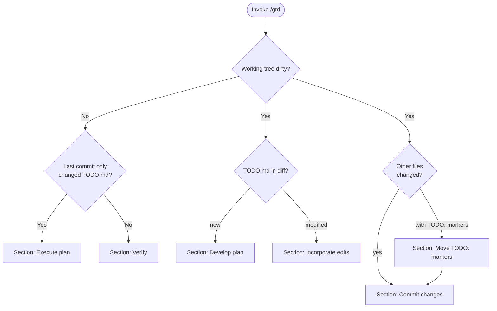

# gi[t]hings.**done**

> [!WARNING]
> This project is an experiment in unapologetic vibe coding. Code might be
> terrible, I don't even know 🤷‍♂️ But otherwise I wouldn't have built it in the
> first place. Now I have something that actually helps me.

A git-aware agent skill that emits the next prompt for an autonomous coding
agent based on the current working-tree state — plan, refine the plan,
execute it, commit, or verify the working tree is healthy.

`gtd` ships as an [Agent Skills Spec](https://agentskills.io/specification)
compliant skill installable via [skills.sh](https://www.skills.sh/). The
agent runs the bundled script, reads the emitted prompt, and follows it
verbatim.

## Installation

```bash
npx skills add pmelab/gtd -g -y
```

That's it. No npm install, no config file, no setup subcommand. The skill
bundles its own prebuilt script.

## Usage

Inside the agent (Claude Code, Codex, etc.), either:

- Type `/gtd` to invoke the skill directly, **or**
- Say something like "take the next step", "what's next", or "gtd" — the
  skill's description matcher picks it up.

The agent runs `node scripts/gtd.js` in your current working directory and
acts on the emitted prompt.

## What it does

`gtd` reads the current git state and composes the prompt from a fixed set of
task sections. Multiple sections can fire in the same run — for example, new
`TODO:` markers in code compose with the "group and commit" task.

| State                                                  | Section emitted                              |
| ------------------------------------------------------ | -------------------------------------------- |
| New (untracked / added) `TODO.md`                      | Develop the plan                             |
| Modified `TODO.md`                                     | Incorporate edits and keep developing        |
| Clean tree, last commit touched only `TODO.md`         | Execute the plan, then delete `TODO.md`      |
| Uncommitted code changes outside `TODO.md`             | Commit the uncommitted changes               |
| Added/modified lines containing `TODO:` markers        | Move `TODO:` markers into `TODO.md`          |
| Clean tree, last commit was not a `TODO.md` checkpoint | Verify the working tree is healthy           |

gtd coordinates phases — it doesn't dictate strategy. How to grill, how to
commit, how to build, how to verify: those are left to other skills (or the
agent's own judgement). The prompts only describe **intent**, plus the
`TODO.md` plumbing that lets phases bridge across runs.

Every prompt also includes the current `git diff HEAD` (untracked files
included) inline.

## Workflow


```mermaid
flowchart TD
    Start([Invoke /gtd]) --> Dirty{Working tree dirty?}
    Dirty -->|No| Last{Last commit only<br/>changed TODO.md?}
    Last -->|Yes| Build[Section: Execute plan]
    Last -->|No| Verify[Section: Verify]
    Dirty -->|Yes| Todo{TODO.md in diff?}
    Todo -->|new| Seed[Section: Develop plan]
    Todo -->|modified| Refine[Section: Incorporate edits]
    Dirty -->|Yes| Other{Other files<br/>changed?}
    Other -->|with TODO: markers| Markers[Section: Move TODO: markers]
    Other -->|yes| Commit[Section: Commit changes]
    Markers --> Commit
```

A typical feature:

1. Create a `TODO.md` with a sketch of what you want.
2. `/gtd` — the agent fleshes it out, appends an `## Open Questions`
   section, and commits `TODO.md`.
3. Open `TODO.md`, write inline answers under each question.
4. `/gtd` again — the agent integrates your answers, removes resolved
   questions, raises new ones, and commits. Repeat until `## Open
   Questions` is empty.
5. `/gtd` once more — agent sees a clean tree with a `TODO.md`-only last
   commit, executes the plan, and deletes `TODO.md` when done.
6. On a clean tree afterwards, `/gtd` verifies the working tree is healthy.

## Q&A format inside TODO.md

The planning sections expect each Open Question to look like this:

```markdown
### What should pagination default to?

**Recommendation:** 25 per page — matches the admin tables elsewhere.

<!-- user answers here -->
```

To answer, replace the comment with your response:

```markdown
### What should pagination default to?

**Recommendation:** 25 per page — matches the admin tables elsewhere.

50 — these tables get long and 25 wastes a click for most users.
```

On the next run, the agent integrates the answer into the plan body and drops
the question from `## Open Questions`.

## Development

```bash
npm install
npm run build        # tsup → scripts/gtd.js (checked in)
npm test             # vitest
npm run test:e2e     # cucumber integration tests
npm run typecheck
npm run lint
```

`scripts/gtd.js` is committed to the repo so the skill installs zero-step.
Rebuild it before tagging a release.

## License

MIT
