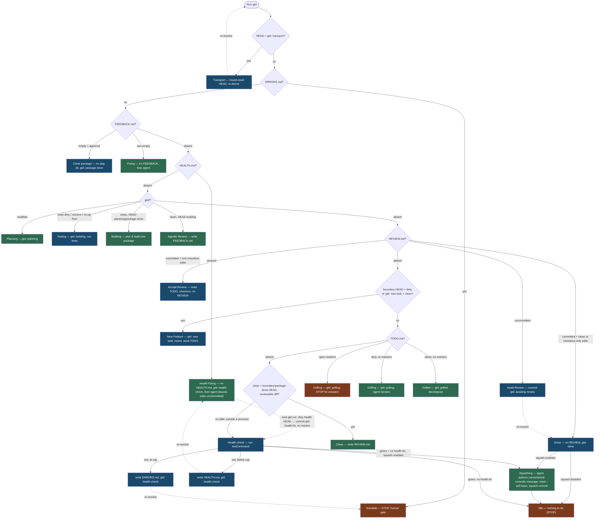

# gi[t]hings.**done**

> [!WARNING] This project is an experiment in unapologetic vibe coding. Code
> might be terrible, I don't even know 🤷‍♂️ But otherwise I wouldn't have built it
> in the first place. Now I have something that actually helps me.

A git-aware CLI that emits the next prompt for an autonomous coding agent based
on the current repository state — capture an idea, grill it into a plan,
decompose it into work packages, execute with parallel subagents, test,
agentically review each package, and finally walk a human through a review.

Internally, gtd is a **pure fold** over git history. The decision core
(`src/Machine.ts`) is a single IO-free function, `resolve(events)` — **no
xstate, no actor, no Effect**. The Effect "edge" (`src/Events.ts`) does all the
git/filesystem IO: it reads the **first-parent** commit subjects since the
merge-base with the default branch (whole-history fallback when there is no
default branch, when HEAD equals the merge-base, or when there is no merge-base
— i.e. budgets engage on the default branch too) plus the working tree, turns
them into a `COMMIT[]` + single terminal `RESOLVE` event stream, and folds them
through the machine. The fold lands on exactly **one** of 19 states, which
selects the prompt. A single run resolves to a single state.

`resolve()` returns that state plus an optional **`EdgeAction`** (a commit,
revert, test run, or file write). The driver loop (`src/main.ts`) performs the
action, then re-gathers and re-resolves — auto-advancing through the
deterministic chain **within one invocation** until it reaches a prompt-bearing
or STOP state. The agent never runs `git commit` itself: every agent leaves its
output **uncommitted**, and the edge commits it with the right flat
`gtd: <phase>` subject on the next hop. The machine stays pure — it only decides
_which_ action; the semantics live in the edge.

`gtd` is an npm CLI — install it, run `gtd` in a repo, and it prints the next
prompt to stdout; a human or any agent reads and follows it.

## Installation

```bash
npm install -g @pmelab/gtd
```

Or run without installing:

```bash
npx @pmelab/gtd
```

No config file, no setup subcommand.

## Usage

Run `gtd` from your repository's working directory — it prints the next prompt
to stdout. It takes **no ref argument** — the review base is always
auto-computed. The one exception is `gtd review <target>`: an explicit,
on-demand human review against a chosen base (see
[Review subcommand](#review-subcommand) below).

On an idle tree outside a process (no steering files, nothing reviewable), `gtd`
now runs a **health check** instead of stopping immediately — `gtd review` is
the only way to start an ad-hoc review when the automatic review base yields no
diff.

## JSON output mode

Pass `--json` to the default `gtd` invocation to receive machine-readable output
instead of a plain prompt:

```bash
gtd --json
```

`--json` applies only to the default command. Passing it to `gtd format` is
rejected with exit code 1 and an error on stderr. It is orthogonal to all other
flags (`--verbose`, `--debug`, etc.) — each controls exactly one concern.

### Output shape

In `--json` mode gtd emits a **single-line JSON object** to stdout:

```json
{ "state": "building", "autoAdvance": true, "prompt": "..." }
```

- **`state`** — the resolved prompt-bearing `GtdState` (e.g. `"grilling"`,
  `"building"`, `"fixing"`, `"clean"`).
- **`autoAdvance`** — the same boolean that selects the loop-tail in plain mode.
  `true` means the workflow advances automatically after the agent acts; `false`
  means a STOP state was reached and human input is expected.
- **`prompt`** — the full markdown prompt, but with **both loop-control tails
  omitted**. In their place, the prompt ends with:
  `Complete the steps above, then end your turn — the harness decides what happens next.`
  The caller is responsible for reading `autoAdvance` and deciding whether to
  run another cycle.

### Loop-ownership division of labor

In **plain mode** the in-prompt tails own the loop — the prompt instructs the
agent to re-run `gtd` when `autoAdvance` is true.

In **`--json` mode** the **caller owns the loop** — the tails are stripped and
the caller reads `autoAdvance` from the JSON object to decide whether to
iterate.

Example driver script:

```bash
#!/usr/bin/env bash
set -euo pipefail

while true; do
  out="$(gtd --json)"
  prompt="$(jq -r .prompt <<<"$out")"
  claude -p "$prompt" --dangerously-skip-permissions
  jq -e .autoAdvance <<<"$out" >/dev/null || break
done
```

### Error behavior

Errors are reported **inside** the JSON object rather than as unstructured text:

```json
{ "state": "error", "autoAdvance": false, "prompt": "<message>" }
```

The process still exits with code 1. Exit codes are otherwise unchanged: 0 on
success, 1 on error.

## Steering files

`gtd` writes and commits temporary steering files that carry workflow state
across runs:

- **TODO.md** — the current plan, under development during grilling.
- **REVIEW.md** — a guided human review spanning a commit diff. Format:
  - `# Review: <short-hash>` heading + `<!-- base: <full-hash> -->` marker
    identifying the review base commit
  - Per-hunk `- [ ]` checkboxes: ticking them (`- [ ]` → `- [x]`) is the
    **approval signal** — checkbox-only edits route to Done; _unchecked_ boxes
    never gate the workflow
  - Open questions at the top, resolved/addressed items at the bottom
    (consistent with TODO.md grilling convention)
- **FEEDBACK.md** — test-failure output, **or** agentic-review findings, to be
  fixed. An **empty** FEEDBACK.md from a clean agentic review signals
  **approval** (→ Close package).
- **ERRORS.md** — the escalation gate: persistent test-failure output that stops
  the loop for a human (written instead of FEEDBACK.md once the fix-attempt cap
  is hit; never auto-consumed).
- **HEALTH.md** — idle health-check failure output: written when `testCommand`
  fails on a bare idle tree (no `.gtd`, no REVIEW.md, no FEEDBACK.md). Carries
  the failure while the dedicated health-fix loop repairs it. Analogous to
  FEEDBACK.md but lives on the default-branch idle path rather than inside a
  build process. Never written while any other steering file is present.
- **.gtd/** — ordered work packages (one numbered directory each) of
  parallelizable subtasks.

Steering files are **authoritative**: while any exist, `gtd` resumes that
workflow regardless of the last commit (even a non-gtd one). They are **never
garbage-collected automatically** — a stale steering file from an abandoned
branch is resumed exactly like a live one, so you must `rm` files from a
workflow you have abandoned.

"**Code changes**" below means pending working-tree changes (tracked or
untracked, respecting `.gitignore`) **outside** the steering set. Changes to
steering files are detected separately.

## Detection model

Every run derives the state in **three layers**:

1. **Transport pre-pass** — if HEAD is `gtd: transport`, short-circuit to the
   Transport state (mixed-reset) before anything else is considered.
2. **Steering-file precedence** — the presence of `ERRORS.md` / `FEEDBACK.md` /
   `HEALTH.md` / `.gtd/` / `REVIEW.md` drives the decision, authoritative
   regardless of HEAD.
3. **HEAD bucket** — with no steering files in play, the last-commit bucket plus
   working-tree cleanliness selects New Feature / Grilling / Clean / Health
   check / Idle.

Within layers 2 and 3 the HEAD subject further disambiguates states the
filesystem alone cannot separate (e.g. inside the `.gtd/` lifecycle, HEAD
`gtd: planning` vs `gtd: building` vs `gtd: package done`).

### Commit taxonomy

`gtd` writes a single **flat** `gtd: <phase>` subject for every workflow commit.
The complete set:

`gtd: new task` · `gtd: grilling` · `gtd: grilled` · `gtd: planning` ·
`gtd: building` · `gtd: errors` · `gtd: feedback` · `gtd: fixing` ·
`gtd: package done` · `gtd: awaiting review` · `gtd: done` · `gtd: health-check`
· `gtd: health-fix` · `gtd: reviewing` — plus the hand-made `gtd: transport`
(see below).

The last commit subject is bucketed two ways:

- **Boundary** — a non-`gtd:` commit, or exactly `gtd: done`. Marks a cold
  start: no workflow in progress.
- **Mid-phase** — any other `gtd: <phase>` subject. Identifies the exact phase
  of an in-progress workflow.

### Precedence ladder (first match wins)

0. **HEAD `gtd: transport`** → Transport.
1. **ERRORS.md present** → Escalate (human gate; STOP).
2. **FEEDBACK.md present** → non-empty → Fixing; **empty** (clean agentic review
   = approval) → Close package.
3. **HEALTH.md present** → Health Fixing (idle health-fix loop; no `.gtd`,
   REVIEW.md, or FEEDBACK.md).
4. **.gtd present** → build lifecycle, routed by tree + HEAD:
   - `.gtd` modified (package files added/edited) → Planning
   - code changes present → Testing
   - clean tree + HEAD `gtd: fixing` (no-op fixer) → Testing (re-test)
   - else clean, by HEAD: `gtd: planning` / `gtd: package done` → Building;
     `gtd: building` → Agentic Review (or Close package, if force-approved)
5. **REVIEW.md present** → review lifecycle, routed by committed-ness + tree:
   committed + clean → Done; committed + checkbox-only edits (only `[ ]`↔`[x]`
   flips in REVIEW.md) → Done; committed + non-checkbox pending edits → Accept
   Review; uncommitted → Await Review (commits REVIEW.md and auto-advances to
   Done). 5a. **HEAD `gtd: done` + `squash` enabled + squash base present + no
   unrelated code dirty** (a lone untracked `SQUASH_MSG.md` is allowed) →
   Squashing; unrelated code dirty → New Feature. 8a. **Green health check + ≥1
   `gtd: health-fix` + `squash` enabled** → Squashing (same agent-authored
   conventional-commits path as the feature-cycle squash — no hardcoded
   placeholder).
6. **Boundary HEAD + pending changes** (and no `.gtd`/REVIEW/FEEDBACK), or HEAD
   `gtd: new task` + clean tree (regenerate a lost seed) → New Feature.
7. **TODO.md present** → Grilling / Grilled.
8. **Boundary or `gtd: package done` HEAD + clean tree** → Clean (review the
   work), **Health check** (run `testCommand` when there is nothing to review —
   on any branch outside a process), or Idle (health check green, nothing to
   do).

Anything matching no rule is corruption — `gtd` **hard-errors** rather than
guess.


```mermaid
flowchart TD
    Start([Run gtd]) --> P0{"HEAD = gtd: transport?"}
    P0 -->|yes| Transport["Transport — mixed-reset HEAD, re-derive"]:::edge
    Transport -.->|re-resolve| Start
    P0 -->|no| P1{"ERRORS.md?"}
    P1 -->|yes| Escalate["Escalate — STOP, human gate"]:::gate
    P1 -->|no| P2{"FEEDBACK.md?"}
    P2 -->|"empty = approval"| Close["Close package — rm pkg dir, gtd: package done"]:::edge
    P2 -->|"non-empty"| Fixing["Fixing — rm FEEDBACK, fixer agent"]:::agent
    P2 -->|absent| P2b{"HEALTH.md?"}
    P2b -->|"present"| HealthFix["Health Fixing — rm HEALTH.md, gtd: health-check, fixer agent (leaves edits uncommitted)"]:::agent
    HealthFix -.->|"next gtd run: dirty health HEAD → commit gtd: health-fix, re-resolve"| HealthCheck
    P2b -->|absent| P3{".gtd/?"}
    P3 -->|"modified"| Planning["Planning — gtd: planning"]:::agent
    P3 -->|"code dirty / resume / no-op fixer"| Testing["Testing — gtd: building, run tests"]:::edge
    P3 -->|"clean, HEAD planning/package done"| Building["Building — pick & build one package"]:::agent
    P3 -->|"clean, HEAD building"| Review["Agentic Review — write FEEDBACK.md"]:::agent
    P3 -->|absent| P4{"REVIEW.md?"}
    P4 -->|"committed + clean or checkbox-only edits"| Done["Done — rm REVIEW, gtd: done"]:::edge
    P4 -->|"committed + non-checkbox edits"| Accept["Accept Review — seed TODO, checkout, rm REVIEW"]:::edge
    P4 -->|"uncommitted"| Await["Await Review — commit gtd: awaiting review"]:::edge
    Await -.->|"re-resolve"| Done
    P4 -->|absent| P5{"boundary HEAD + dirty,<br/>or gtd: new task + clean?"}
    Done -->|"squash enabled"| Squashing["Squashing — agent authors conventional-commits message, reset --soft base, squash commit"]:::agent
    Done -->|"squash disabled"| Idle
    Squashing --> Idle["Idle — nothing to do (STOP)"]:::gate
    P5 -->|yes| NewFeature["New Feature — gtd: new task, revert, seed TODO"]:::edge
    P5 -->|no| P6{"TODO.md?"}
    P6 -->|"open markers"| GrillStop["Grilling — gtd: grilling, STOP for answers"]:::gate
    P6 -->|"dirty, no markers"| GrillIter["Grilling — gtd: grilling, agent iterates"]:::agent
    P6 -->|"clean, no markers"| Grilled["Grilled — gtd: grilled, decompose"]:::agent
    P6 -->|absent| P7{"clean + boundary/package-done HEAD,<br/>reviewable diff?"}
    P7 -->|yes| CleanState["Clean — write REVIEW.md"]:::agent
    P7 -->|"no (idle, outside a process)"| HealthCheck["Health check — run testCommand"]:::edge
    HealthCheck -->|"green, no health-fix"| Idle
    HealthCheck -->|"green + ≥1 health-fix, squash enabled"| Squashing
    HealthCheck -->|"red, below cap"| HealthMd["write HEALTH.md, gtd: health-check"]:::edge
    HealthMd -.->|"re-resolve"| HealthFix
    HealthCheck -->|"red, at cap"| ErrorsMd["write ERRORS.md, gtd: health-check"]:::edge
    ErrorsMd -.->|"re-resolve"| Escalate
    classDef edge fill:#1a4a6b,color:#fff
    classDef agent fill:#2d6a4f,color:#fff
    classDef gate fill:#7a3b1d,color:#fff
```

> Blue = **edge-only** (the edge performs IO; no prompt rendered). Green =
> **agent** (a prompt is emitted; the agent acts, then re-runs gtd). Brown =
> **gate** (STOP for the human, or nothing to do).

### Illegal combinations

These never arise in normal flow; if seen, `gtd` hard-errors rather than
guessing:

- REVIEW.md + .gtd
- REVIEW.md + TODO.md
- FEEDBACK.md + REVIEW.md
- FEEDBACK.md without .gtd
- ERRORS.md + FEEDBACK.md
- ERRORS.md without .gtd
- HEALTH.md + .gtd (health check only runs from a bare idle tree)
- HEALTH.md + REVIEW.md (same)
- HEALTH.md + FEEDBACK.md (same)
- HEALTH.md + ERRORS.md (escalation wins; HEALTH.md must not coexist)

Legal coexistence: `.gtd` + TODO.md (plan kept alongside packages during
**Planning** only — TODO.md is deleted at the first Building turn);
FEEDBACK.md + `.gtd` (a fix during build).

### Single writer, linear branch

State is folded from **first-parent** history: gtd assumes a **single writer on
a linear branch**. A merge commit at HEAD is unsupported — it breaks the counter
folds, the review base, and last-commit detection (documented, not handled).

Distribute work by **sequential handoff** (one active machine at a time) over
**rebase / fast-forward**, not by merging parallel branches. The primitive for
carrying _uncommitted_ work across machines or branches is `gtd: transport`:

```bash
git add -A && git commit -m "gtd: transport"   # on the source machine
git push                                        # … then pull on the far side
```

There is **no `gtd transport` subcommand** — you make this commit by hand. The
**Transport** state consumes it: on the far side, the next `gtd` run sees the
`gtd: transport` HEAD, mixed-resets it (`git reset HEAD~1`) to drop the work
back into the working tree uncommitted, and re-derives state from scratch. If
the transport commit is the repository's root commit (no parent), `gtd` fails
immediately with a clear error instead of looping.

## The 19 states

Each state has a **condition** (when it wins), a deterministic **action**, the
**commit(s)** it produces, and where it **advances**. States marked
**auto-advance** re-run `gtd` themselves; **STOP** states hand control to a
human; **edge-only** states render no prompt at all — the driver performs their
action and re-resolves silently.

| State              | Kind                             | Wins when                                                                                                                                                                                                                                                                                                                                                                                                                                             | Action & commit                                                                                                                                                                                                                                                                                                                                                                                           | Advances to                                                                                   |
| ------------------ | -------------------------------- | ----------------------------------------------------------------------------------------------------------------------------------------------------------------------------------------------------------------------------------------------------------------------------------------------------------------------------------------------------------------------------------------------------------------------------------------------------- | --------------------------------------------------------------------------------------------------------------------------------------------------------------------------------------------------------------------------------------------------------------------------------------------------------------------------------------------------------------------------------------------------------- | --------------------------------------------------------------------------------------------- |
| **Transport**      | edge-only, auto                  | HEAD `gtd: transport` (hand-made handoff commit)                                                                                                                                                                                                                                                                                                                                                                                                      | mixed-reset HEAD (`git reset HEAD~1`), keep work in tree; **no commit**                                                                                                                                                                                                                                                                                                                                   | re-derive from the restored tree                                                              |
| **Escalate**       | STOP                             | ERRORS.md present                                                                                                                                                                                                                                                                                                                                                                                                                                     | none                                                                                                                                                                                                                                                                                                                                                                                                      | held until the human deletes ERRORS.md                                                        |
| **Fixing**         | agent, auto                      | non-empty FEEDBACK.md present                                                                                                                                                                                                                                                                                                                                                                                                                         | inline FEEDBACK into the prompt, remove FEEDBACK.md; commit its removal `gtd: fixing` (FEEDBACK was committed by Testing) or `gtd: feedback` (uncommitted, written by Agentic Review)                                                                                                                                                                                                                     | fixer edits → Testing                                                                         |
| **Health Fixing**  | agent, auto                      | HEALTH.md present (no `.gtd`, REVIEW.md, or FEEDBACK.md)                                                                                                                                                                                                                                                                                                                                                                                              | read HEALTH.md into the prompt, commit its removal `gtd: health-check` (HEALTH.md removed so next resolve re-enters `resolveCleanOrIdle`); fixer leaves edits **uncommitted**                                                                                                                                                                                                                             | fixer edits uncommitted → next `gtd` invocation commits them `gtd: health-fix` → Health check |
| **Close package**  | edge-only, auto                  | empty FEEDBACK.md present (clean review); also reached from Agentic Review force-approve                                                                                                                                                                                                                                                                                                                                                              | rm FEEDBACK.md, rm the first (finished) package dir (+ the now-empty `.gtd/`); commit `gtd: package done`                                                                                                                                                                                                                                                                                                 | more packages → Building; `.gtd` gone → Clean                                                 |
| **Planning**       | agent, auto                      | `.gtd` present **and modified**; HEAD `gtd: grilled` or `gtd: planning`                                                                                                                                                                                                                                                                                                                                                                               | commit the `.gtd/` changes `gtd: planning`                                                                                                                                                                                                                                                                                                                                                                | continue decomposing, else → Building                                                         |
| **Testing**        | edge-only, auto                  | `.gtd` present, no FEEDBACK/ERRORS, and a reason to test: code changes, a pending ERRORS.md deletion (human resume), or a clean tree under HEAD `gtd: fixing` (no-op fixer)                                                                                                                                                                                                                                                                           | commit pending tree `gtd: building`, run `testCommand`; green → proceed; red → write FEEDBACK (below cap) or ERRORS (at cap), commit `gtd: errors`; if captured output is empty/whitespace, a sentinel string is written so the file is never empty (empty FEEDBACK remains reserved for agentic-review approval)                                                                                         | green → Agentic Review; FEEDBACK → Fixing; ERRORS → Escalate                                  |
| **Building**       | agent, auto                      | `.gtd` present and clean, clean tree; HEAD `gtd: planning` or `gtd: package done`                                                                                                                                                                                                                                                                                                                                                                     | if HEAD `gtd: planning` and TODO.md present, delete TODO.md and commit (prefix unchanged, fires once); select the first package, inline its tasks; agent leaves work **uncommitted**                                                                                                                                                                                                                      | Testing                                                                                       |
| **Agentic Review** | agent, auto                      | `.gtd` present and clean, clean tree; HEAD `gtd: building`                                                                                                                                                                                                                                                                                                                                                                                            | reviewer writes FEEDBACK.md (empty = approval), uncommitted — **unless** force-approved (kill-switch off or review-fix threshold hit), which routes straight to Close package                                                                                                                                                                                                                             | empty FEEDBACK → Close package; non-empty → Fixing                                            |
| **Done**           | edge-only, auto                  | REVIEW.md committed + clean tree, **or** committed + checkbox-only edits (only `- [ ]`→`- [x]` flips in REVIEW.md = approval)                                                                                                                                                                                                                                                                                                                         | rm REVIEW.md, commit `gtd: done`                                                                                                                                                                                                                                                                                                                                                                          | Squashing (if enabled) or Idle                                                                |
| **Squashing**      | agent, auto                      | no steering files, HEAD `gtd: done` or green Health check with ≥1 `gtd: health-fix`, `squash` enabled, squash base present, no unrelated code dirty (a lone untracked `SQUASH_MSG.md` is allowed)                                                                                                                                                                                                                                                     | agent authors a conventional-commits message from the full `<base>..HEAD` diff, then runs `git reset --soft <base>` + `git commit` — collapses all intermediate `gtd: *` commits (including any interleaved non-gtd commits) into one; **gtd then STOPs** — post-squash review fires only on the next manual `gtd` run                                                                                    | Idle (STOP)                                                                                   |
| **Accept Review**  | edge-only, auto                  | REVIEW.md committed + pending **non-checkbox** edits (human annotated REVIEW.md with comments / edited code)                                                                                                                                                                                                                                                                                                                                          | seed TODO.md from the changeset, `git checkout` to discard the code edits, rm REVIEW.md; **all uncommitted**                                                                                                                                                                                                                                                                                              | Grilling                                                                                      |
| **Await Review**   | edge-only, auto                  | REVIEW.md present and **uncommitted** (freshly written by Clean)                                                                                                                                                                                                                                                                                                                                                                                      | commit REVIEW.md `gtd: awaiting review`                                                                                                                                                                                                                                                                                                                                                                   | Done (auto, same run)                                                                         |
| **New Feature**    | edge-only, auto                  | boundary HEAD + pending changes (code and/or a new uncommitted TODO.md), **or** HEAD `gtd: new task` + clean tree (lost-seed regen)                                                                                                                                                                                                                                                                                                                   | commit the raw input verbatim `gtd: new task` (unless already there), `git revert --no-commit` it back to a clean baseline, seed TODO.md from that diff — revert + seed left **uncommitted**                                                                                                                                                                                                              | Grilling                                                                                      |
| **Grilling**       | agent (iterate) / STOP (answers) | TODO.md present, not New Feature                                                                                                                                                                                                                                                                                                                                                                                                                      | commit pending edits `gtd: grilling`. Open-question markers present → STOP for the human to answer inline; no markers but dirty → grilling agent iterates                                                                                                                                                                                                                                                 | converge (no markers, clean tree) → Grilled                                                   |
| **Grilled**        | agent, auto                      | TODO.md present, no markers, clean tree                                                                                                                                                                                                                                                                                                                                                                                                               | commit pending `gtd: grilled`                                                                                                                                                                                                                                                                                                                                                                             | decompose into `.gtd/` → Planning                                                             |
| **Clean**          | agent                            | no steering files, clean tree, boundary or `gtd: package done` HEAD, and the review base yields a **non-empty** diff                                                                                                                                                                                                                                                                                                                                  | compute the review base (three rules — see below); agent writes REVIEW.md **uncommitted** with `# Review: <short-hash>` heading, `<!-- base: <full-hash> -->` marker, and per-hunk `- [ ]` checkboxes (ticking them signals approval → Done)                                                                                                                                                              | Await Review                                                                                  |
| **Health check**   | edge-only, auto                  | no steering files, outside a process with no reviewable diff (any branch) — the `!reviewable` case from rule 8. Two entry points: (a) clean tree under a boundary or `gtd: package done` HEAD; (b) **dirty tree under a `gtd: health-check` or `gtd: health-fix` HEAD with `!pendingErrorsDeletion`** (the fixer's uncommitted edits — commits them `gtd: health-fix` and re-runs the health check within the same `gtd` invocation; NOT corruption). | run `testCommand` (entry point a); or commit pending edits `gtd: health-fix`, then run `testCommand` (entry point b). green + no prior `gtd: health-fix` → Idle (no commit); red below `fixAttemptCap` → write HEALTH.md, commit `gtd: health-check` → Health Fixing; red at cap → write ERRORS.md, commit `gtd: health-check` → Escalate; green + ≥1 `gtd: health-fix` → Squashing (if `squash`) or Idle | green → Idle or Squashing; red below cap → Health Fixing; red at cap → Escalate               |
| **Idle**           | STOP                             | no steering files, clean tree, health check passed with no prior `gtd: health-fix` commits, and nothing to review                                                                                                                                                                                                                                                                                                                                     | none (no commit — the health check edge terminates the driver loop directly)                                                                                                                                                                                                                                                                                                                              | —                                                                                             |

Every prompt also embeds the current `git diff HEAD` (untracked files included)
inline, plus the last commit subject and working-tree status, so the agent has
full context.

### Review base — three rules

The review base (the commit whose diff to HEAD forms the REVIEW.md) is chosen by
three rules evaluated in priority order:

1. **Within a process, first review** — a `gtd: grilling` commit exists after
   the last `gtd: done` (or task start), but no `gtd: awaiting review` yet →
   base = first `gtd: grilling` of the current task cycle; `refDiff` spans the
   whole task.
2. **Within a process, incremental** — `gtd: awaiting review` also present in
   the current cycle (takes precedence over rule 1) → base = last
   `gtd: awaiting review`; `refDiff` spans only the post-review changes.
3. **Outside a process (any branch)** — no `gtd: grilling` after the last
   `gtd: done` → skip review; `reviewBase`/`refDiff` unset → Idle (the health
   check runs instead).

In all cases, if the diff from the chosen base to HEAD is empty,
`reviewBase`/`refDiff` are left unset and the machine settles in Idle.

## The fix loops & counter folds

Three derived counters drive the budgeted loops. All are **folded in the
machine** from flags on the `COMMIT[]` stream — never recomputed at the edge:

- **`testFixCount`** — `gtd: errors` commits (test-fix attempts) since the
  **most recent of** {a package start (`gtd: planning` / `gtd: package done`), a
  `gtd: feedback` (start of a review-fix), or a commit that **removed
  ERRORS.md** (a human resume)}. So each test-fix sub-loop, each review-fix
  round, and every human resume starts a **fresh budget**.
- **`reviewFixCount`** — `gtd: feedback` commits (review-fix rounds) since the
  most recent package start.
- **`healthFixCount`** — `gtd: health-check` commits since the most recent
  commit that removed HEALTH.md (or the start of branch history if none). Reuses
  `fixAttemptCap` — no separate config key.

### Test-fix loop (`fixAttemptCap`, default 3)

When Testing's run is red, it writes the captured output and commits
`gtd: errors`, incrementing `testFixCount`. If the captured output is empty or
whitespace-only (e.g. a command that exits non-zero with no output), a sentinel
string is written instead — so FEEDBACK/ERRORS is never empty. Empty FEEDBACK
remains reserved exclusively for Agentic Review's deliberate approval signal.

```
Building → Testing(red) → Fixing → Testing(red) → … → Testing(green)
                 │                                          │
                 └── below cap: FEEDBACK.md, gtd: errors ───┘
                 └── at/over the cap: ERRORS.md, gtd: errors → Escalate
```

Below the cap, the failure goes to **FEEDBACK.md** and Fixing applies a fix. At
or over the cap (`testFixCount >= fixAttemptCap`), it goes to **ERRORS.md**
instead and the loop **stops** at Escalate. The human investigates, then deletes
ERRORS.md — which **resets the fix-attempt budget** (the next run re-tests and
grants a fresh `cap` attempts before escalating again). While ERRORS.md exists,
every run resolves straight back to Escalate.

### Health-fix loop (`fixAttemptCap`, `squash` — no new config)

Outside a process (any branch), when there is no reviewable diff and no steering
files, `gtd` runs `testCommand` instead of stopping. This reuses `fixAttemptCap`
(default 3) and `squash` — no new config keys are introduced.

```
Idle path → Health check(red) → Health Fixing → [fixer edits, uncommitted]
                  │                                        │
                  │                           next gtd run: commit gtd: health-fix
                  │                                        │
                  │                              Health check(red) → …
                  │                                        │
                  │                              Health check(green)
                  │                                        │
                  └── below cap: HEALTH.md, gtd: health-check           └── green + ≥1 health-fix → Squashing (if squash enabled) → Idle
                  └── at/over the cap: ERRORS.md, gtd: health-check → Escalate
```

- **green, no prior `gtd: health-fix`** → Idle immediately (no commit).
- **red, below `fixAttemptCap`** → write test output to HEALTH.md, commit
  `gtd: health-check` → **Health Fixing** agent fixes the code and leaves its
  edits **uncommitted**. The next `gtd` invocation detects the dirty tree under
  the `gtd: health-check` HEAD, commits the fixer's edits as `gtd: health-fix`
  (an edge-only `health-check` state with a `commitPending` action), and
  immediately re-runs the health check within that same invocation.
- **red, at or over `fixAttemptCap`** → write test output to ERRORS.md, commit
  `gtd: health-check` → **Escalate** (human gate). Delete ERRORS.md to reset the
  budget and resume.
- **green, ≥1 `gtd: health-fix` present** → health-fix cycle converged: if
  `squash` is enabled → **Squashing** (squash base = parent of the first
  `gtd: health-check` of the current run); otherwise → Idle (no commit).

### Review-fix loop & agentic review (`reviewThreshold`, default 3)

After a green test run, **Agentic Review** reviews the package's accumulated
diff against its task specs and **always writes FEEDBACK.md**:

```
Testing(green) → Agentic Review → empty FEEDBACK → Close package → next package
                       │
                       └─ findings → Fixing(gtd: feedback) → Testing → Agentic Review → …
```

An **empty FEEDBACK.md is approval** — Close package removes the finished
package directory and commits `gtd: package done`. Findings route to Fixing
(committed `gtd: feedback`, incrementing `reviewFixCount`), which loops back
through the test gate and re-reviews. Once `reviewFixCount >= reviewThreshold`,
Agentic Review **force-approves** (skips the review, closes the package
directly) so a package can never review-loop forever. Setting
**`agenticReview: false`** is a kill-switch: every package force-approves
immediately and the branch proceeds straight to human review.

### Per-package close

Close package operates on **one** package at a time: it deletes the first
(finished) numbered directory under `.gtd/` — plus the now-empty `.gtd/` itself
if it was the last — and commits `gtd: package done`, which sends Building to
the next package (or Clean once `.gtd/` is gone). Each package thus runs the
full
`Building → Testing → Agentic Review → (Fixing → Testing → Agentic Review)* → Close`
loop before the next one starts.

## A typical feature

1. **Capture.** Leave a sketch in `TODO.md` (or just some pending code changes),
   then run `gtd`. **New Feature** commits the raw input `gtd: new task`,
   reverts it back to a clean baseline, and seeds an uncommitted `TODO.md` from
   the diff.
2. **Grill.** Run `gtd` — the **Grilling** agent (planning model) develops the
   plan, appends open questions each marked with a `<!-- user answers here -->`
   line, and leaves `TODO.md` uncommitted; the edge commits `gtd: grilling`.
   While any marker is present, gtd **STOPs** for you.
3. **Answer.** Open `TODO.md`, replace each `<!-- user answers here -->` with
   your answer, and run `gtd` again. The agent integrates answers, moves them to
   `## Resolved`, and raises fresh questions — repeat until none remain (it
   writes `no open questions — run gtd to plan` with no markers).
4. **Converge.** A clean tree with no markers resolves to **Grilled**
   (`gtd: grilled`), then **Planning** decomposes `TODO.md` into ordered `.gtd/`
   work packages (`gtd: planning`).
5. **Build.** Run `gtd` — **Building** first deletes `TODO.md` (when HEAD is
   `gtd: planning` and it is still present, committed under the same
   `gtd: planning` prefix — fires once). It then names the single next package
   and inlines its task files; the agent spawns one parallel subagent per task
   (execution model + TDD) and leaves the work **uncommitted**. The next run is
   **Testing**: the edge commits `gtd: building`, then runs `testCommand`.
6. **Review each package.** On green, **Agentic Review** writes FEEDBACK.md.
   Empty → **Close package** (`gtd: package done`) and on to the next package;
   findings → **Fixing** → back through the test gate. A red test run drives the
   test-fix loop until green or Escalate.
7. **Human review.** When `.gtd/` is gone, **Clean** writes a `REVIEW.md` for
   the diff since the review base (uncommitted); **Await Review** (edge-only)
   commits it `gtd: awaiting review` and auto-advances to Done in the same run.
8. **Approve or revise.** Re-run `gtd` with **no** changes to approve → **Done**
   (`gtd: done`) → **Squashing** → **Idle**. The Squashing agent authors a
   conventional-commits message from the full process diff and squashes all
   intermediate `gtd: *` commits into one with `git reset --soft <base>` +
   `git commit`, then **gtd STOPs**. The base is the parent of the current
   cycle's start marker **nearest to HEAD** (the last `gtd: new task`; for
   legacy cycles the last contiguous `gtd: grilling` run), and on a feature
   branch it never reaches below the merge-base with the default branch — stray
   markers left behind by older squashes can never drag the squash into
   previously shipped features. Post-squash review does not fire automatically —
   it fires only on the next manual `gtd` run (when the squash commit is the
   boundary HEAD and a reviewable diff exists). Squashing fires when the tree
   has no unrelated code dirty — a lone untracked `SQUASH_MSG.md` is tolerated
   and deleted before the squash commit. If unrelated code is dirty at
   `gtd: done`, gtd routes to **New Feature** instead. Set `squash: false` in
   `.gtdrc` to skip squashing and go straight to Idle. Checking off REVIEW.md
   checkboxes (`- [ ]` → `- [x]`) also counts as approval and routes to **Done**
   — they are navigation aids, not feedback. Only **non-checkbox** edits (code
   changes, inline comments, textual annotations in REVIEW.md) trigger **Accept
   Review**, which seeds a fresh `TODO.md` from your feedback, discards your
   code edits, removes `REVIEW.md`, and re-enters Grilling — the loop starts
   over.

## Configuration

gtd reads an optional `.gtdrc` config file via
[cosmiconfig](https://github.com/cosmiconfig/cosmiconfig). With no config, the
built-in defaults apply. Supported filenames (searched in this order):

- `.gtdrc`
- `.gtdrc.json`
- `.gtdrc.yaml`
- `.gtdrc.yml`
- `gtd.config.json`
- `gtd.config.yaml`

### Schema

- **`testCommand`** (string, default `npm run test`) — the command the edge runs
  in the Testing state to verify a built package, and in the Health check state
  on the default-branch idle path.
- **`fixAttemptCap`** (non-negative integer, default `3`) — the test-fix budget:
  how many `gtd: errors` attempts are allowed per sub-loop before the failure is
  escalated to ERRORS.md (Escalate). `0` disables the cap (escalates immediately
  on the first red run). Also reused as the health-fix budget (no separate
  config key).
- **`reviewThreshold`** (integer ≥ 1, default `3`) — the review-fix budget: how
  many `gtd: feedback` rounds are allowed per package before Agentic Review
  force-approves.
- **`agenticReview`** (boolean, default `true`) — kill-switch for the
  per-package Agentic Review gate. Set to `false` to skip agentic review
  entirely; every package force-approves and the branch proceeds directly to
  human review.
- **`squash`** (boolean, default `true`) — after `gtd: done`, collapse all
  intermediate `gtd: *` commits into a single conventional-commits commit via
  `git reset --soft <base>` + `git commit`. Set `false` to keep the granular
  history.
- **`models`** — model selection for the subagent-spawning states:
  - `planning` — high-reasoning tier (default `claude-opus-4-8`), used by
    `decompose`, `grilling`, `agentic-review`, and `clean`.
  - `execution` — everyday tier (default `claude-sonnet-4-8`), used by
    `building` and `fixing`.
  - `states.*` — per-state overrides keyed by the six agent states: `decompose`
    (shared by the Grilled and Planning states), `grilling`, `building`,
    `fixing`, `agentic-review`, `clean`. Unknown `states` keys are **rejected**.
- **`$schema`** (string, optional) — a recognized key that is **stripped before
  validation**, so it never counts as an unknown key. Point it at the published
  schema to get schema-backed autocompletion and inline docs in your editor. A
  `schema.json` is generated from the config schema at build time and ships with
  the package (and is published/committed on release).

### Validation and errors

If a config file fails to load or is invalid, gtd **exits with code 1** and
writes a human-readable error to **stderr** (never stdout):

- **Parse errors** (malformed YAML/JSON) — message includes the offending
  filename, e.g. `gtd: /path/to/.gtdrc: unexpected token`.
- **Non-object top-level** — a YAML list or `null` at the root is rejected with
  the filename in the message.
- **Schema violations** — unknown keys or out-of-range values emit
  `Invalid gtd config: <field>: <reason>`. The message is concise and does not
  dump the full type tree.
- **Missing test binary** — if `testCommand` names an executable that cannot be
  found (`ENOENT`), gtd exits with code 1 and writes
  `gtd: test command not found: <command>` to **stderr**. No stack trace is
  emitted to stdout. A non-zero test exit is _not_ an error — it drives the
  normal red-path (FEEDBACK → Fixing).

### Lookup and precedence

gtd walks from the current working directory **up to your home directory** (or
to the filesystem root when cwd is outside home), collecting every `.gtdrc` it
finds along the way. All found levels are **deep-merged**, with the **innermost
(cwd) config winning** on conflicts.

This makes the worktree-parent case easy: drop a single `.gtdrc` in a shared
parent directory and it cascades to **all** checkouts/worktrees beneath it,
while any individual checkout can still override settings with its own `.gtdrc`.

### Auto-init

On every run, if the cwd→root walk finds **no** config anywhere, gtd creates and
commits a starter config at the **git root**: a `.gtdrc.json` containing only a
`$schema` link:

```json
{
  "$schema": "https://raw.githubusercontent.com/pmelab/gtd/main/schema.json"
}
```

It is committed as `chore: add .gtdrc.json`. This wires up editor autocompletion
out of the box; add any settings below the `$schema` line to override the
defaults.

Auto-init is skipped when HEAD is a `gtd: transport` commit: transport is a
consume-only handoff HEAD (mixed-reset in the Transport pre-pass), so committing
a config stub on top of it would displace the transport commit — and, when it is
the repository root, silently mask the "cannot reset transport commit" error.
The stub is created on a later run, once the transport HEAD has been consumed.

### Example

```yaml
# .gtdrc.yaml
testCommand: pnpm test
fixAttemptCap: 3
reviewThreshold: 3
agenticReview: true
squash: true
models:
  planning: claude-opus-4-8
  execution: claude-sonnet-4-8
  states:
    decompose: claude-opus-4-8
    building: claude-sonnet-4-8
```

## Build orchestration

When a plan is finalized, gtd enters build mode.

### Decompose

The Grilled / Planning states spawn a planning-model subagent that breaks
`TODO.md` into executable work packages under `.gtd/`:

```
.gtd/
  01-auth-module/
    01-define-types.md
    02-implement-login.md
  02-api-endpoints/
    01-create-routes.md
    02-add-middleware.md
```

Rules:

- **Packages are sequential, in ordinal dependency order** — `01-`, `02-`, …;
  the set is frozen once written. Package 02 cannot start until 01 is complete.
- **Each package is green on its own** — the test suite runs after every
  package, so none may leave the tree red for a later package to fix.
- **Tasks within a package are parallel and file-disjoint** — one subagent per
  task, no isolation; tasks that would touch the same file are merged into one.
- **Vertical slices, not horizontal** — each package is a thin, end-to-end
  slice; prefer many thin packages over a "set up infrastructure" package.
- **Task files are self-contained** — description, acceptance-criteria
  checkboxes, relevant file paths, constraints, and edge cases.

Packages carry only their task `.md` files; the edge commits each built package
`gtd: building`.

### Execute

Execution is **one package per cycle**. gtd selects the single next package
itself, names it in the prompt, and inlines its task files' full contents — the
prompt is self-contained, so the agent never browses `.gtd/` or picks a package.
A single cycle:

1. Spawn parallel execution-model workers for all tasks in the selected package
   (with the `tdd` skill).
2. If a worker fails (crash/timeout, not a test failure): ask the user to
   retry/skip/abort.
3. Leave all changes **uncommitted**. Do not commit, do not delete the package
   directory, do not run tests here.
4. Re-run gtd — the next cycle's edge (Testing) commits the work `gtd: building`
   and runs `testCommand` to verify it.

Verification is deterministic and lives in the edge, not the prompt: gtd runs
the configured `testCommand` itself, captures stdout + stderr + the exit code,
and the **machine** branches on it (green → Agentic Review; red below cap →
Fixing; red at/over cap → Escalate).

## Q&A format inside TODO.md

The agent never asks the user clarifying questions directly — it records
uncertainty in `TODO.md` under `## Open Questions` instead. The grilling phase
is gated by a single **convergence marker**: every open question carries a
`<!-- user answers here -->` line directly beneath it. While _any_ marker is
present, gtd **STOPs** and waits for you to answer inline.

The `## Open Questions` section lives at the TOP of TODO.md (before the plan
body). Each question looks like this:

```markdown
### What should pagination default to?

**Recommendation:** 25 per page — matches the admin tables elsewhere.

<!-- user answers here -->
```

To answer, replace the comment with your response:

```markdown
### What should pagination default to?

**Recommendation:** 25 per page — matches the admin tables elsewhere.

50 — these tables get long and 25 wastes a click for most users.
```

On the next run the agent integrates the answer into the plan body and moves the
question to the `## Resolved` graveyard at the bottom:

```markdown
## Resolved

### What should pagination default to?

**Recommendation:** 25 per page — matches the admin tables elsewhere.

**Answer:** 50 — these tables get long and 25 wastes a click for most users.
```

When there are genuinely no open questions left, the agent writes the sentinel
line `no open questions — run gtd to plan` and leaves **no** markers — a clean
tree with no markers is what advances the plan to **Grilled** and decomposition.

## CLI flags

```
Usage: gtd [command] [options]

Commands:
  (default)        Run the gtd driver loop — detect state, emit next prompt
  format <file>    Format a markdown file in place
  review <target>  Ad-hoc human review against a git ref or branch
  status           Print current state, next state, and pending edge actions (no actions, no prompt)

Options:
  --json           Output structured JSON instead of plain text
  --verbose        Show verbose output (thinking deltas, tool events)
  --debug          Show debug-level internal information
  --version, -v    Print version and exit
  --help, -h       Print this help and exit
```

`--version` (`-v`) and `--help` (`-h`) short-circuit before any git or
repository-state work — they run outside a repo and in any repo state.

## Subcommands

gtd ships three subcommands: `format`, `review`, and `status`.

## Review subcommand

```bash
gtd review <target>
```

Starts an explicit, on-demand human review of the diff between HEAD and
`merge-base(<target>, HEAD)`. Use this when the automatic review base yields no
diff (idle tree outside a process) or when you want to review against a specific
base regardless of workflow state.

### Flow

1. `gtd review <target>` computes the diff HEAD adds over
   `merge-base(<target>, HEAD)`.
2. The edge writes an empty anchor commit `gtd: reviewing` (no content — just
   the marker).
3. The **Clean** state writes `REVIEW.md` with the computed diff and emits the
   normal review prompt. `--json` is accepted and enables auto-advance mode
   (same behavior as the default command).
4. The normal loop then drives: **Await Review** → **Done** → **Squashing**,
   collapsing back to the `gtd: reviewing` anchor commit.

### Error handling

All errors exit with **code 1** and write a message to **stderr**:

- **Missing target** — `gtd review` with no argument:
  `gtd review: missing target argument`
- **Extra arguments** — `gtd review main extra`:
  `gtd review: too many arguments — expected one target, got: …`
- **Unresolvable ref** — the target cannot be resolved by git:
  `gtd review: cannot resolve ref '<target>': <error message>`
- **Empty diff** — the merge-base diff between `<target>` and HEAD is empty
  (nothing to review):
  `gtd review: nothing to review (<target> diff is empty after filtering)`

## Status subcommand

```bash
gtd status
```

Pure, read-only introspection. Prints the current machine state, the state the
next real `gtd` run would stop at, and a short summary of the edge actions the
next run would perform. Performs **nothing** (no commit, reset, or file write)
and prints **no prompt** — guaranteed side-effect free.

### Fields

| Field             | Description                                                       |
| ----------------- | ----------------------------------------------------------------- |
| `state`           | Current machine state                                             |
| `nextState`       | State the next `gtd` run would stop at, or `null` for edge-only   |
| `willAutoAdvance` | `true` when the current state is edge-only (auto-advances on run) |
| `edgeActions`     | List of edge actions the next run would perform before prompting  |

### One-hop semantics

`status` runs the same read-only gather+resolve the driver's first iteration
does, then reports it without looping or performing.

- A **prompt-bearing / human / terminal** current state reports itself as
  `nextState`. The next run performs any pending edge action, then prompts
  there.
- An **edge-only** current state reports `nextState: null` and
  `willAutoAdvance: true`, naming the immediate edge action. Because the landing
  state after auto-advance depends on side effects (test pass/fail, commits)
  that `status` refuses to run, it honestly reports the current state rather
  than guessing a landing state. There is **no** multi-hop simulation.

### Output

Default (human-readable) — `building` example:

```
State:      building
Next state: building (next run prompts here)
Edge actions:
  - commit pending changes as "gtd: building"
```

With `--json` — same example:

```json
{
  "state": "building",
  "nextState": "building",
  "willAutoAdvance": false,
  "edgeActions": ["commit pending changes as \"gtd: building\""]
}
```

Edge-only example (`testing` state):

```json
{
  "state": "testing",
  "nextState": null,
  "willAutoAdvance": true,
  "edgeActions": ["run the test suite (attempt 1)"]
}
```

The JSON envelope contains no `prompt` field — this distinguishes it from the
default `gtd` run and `gtd review` JSON output.

### Requirements

- Must be run from the **repository root** (same cwd guard as other repo
  commands).
- Takes **no arguments** — extra args are rejected with an error.

## Format subcommand

`gtd format` formats a markdown file in place:

```bash
gtd format <file>
```

It uses a bundled prettier with a fixed, gtd-owned config (`parser: "markdown"`,
`printWidth: 80`, `proseWrap: "always"`). The host repo's `.prettierrc` is
**intentionally ignored** — determinism across consumer repos matters more than
local style preferences.

The grilling and clean prompts instruct the agent to run this command after
every edit to `TODO.md` or `REVIEW.md`, so those files stay consistently
formatted regardless of the host project's toolchain.

### Error handling

All errors exit with **code 1** and write a message to **stderr**:

- **Missing path** — `gtd format` with no argument:
  `gtd format: missing file path argument`
- **Extra arguments** — `gtd format a.md b.md`:
  `gtd format: too many arguments — expected one path, got: …`
- **Non-markdown file** — any extension other than `.md` or `.markdown`
  (case-insensitive):
  `gtd format: <file> is not a markdown file (expected .md or .markdown)`
- **File not found** — the path does not exist:
  `gtd: skipped formatting <file>: not found`

> [!NOTE] Upgrading gtd may reflow existing `TODO.md` files if the bundled
> prettier major version changes.

## Development

```bash
npm install
npm run dev          # run from source, no build (node dev/run.mjs)
npm run build        # tsup → dist/gtd.bundle.mjs
npm test             # vitest unit tests (the pure resolver) — --project unit
npm run test:e2e     # gherkin e2e via vitest + quickpickle — --project e2e
npm run test:mutation # StrykerJS mutation testing
npm run typecheck
npm run lint
```

### Pre-commit hook

A pre-commit hook is installed automatically via the `prepare` script when you
run `npm install` on a fresh clone — no manual setup needed.

The hook runs [lint-staged](https://github.com/lint-staged/lint-staged) with
[Prettier](https://prettier.io/), formatting every staged file before each
commit:

```
prettier --ignore-unknown --write
```

This mirrors the `format:check` step enforced in CI (`prettier --check .`),
keeping committed code consistently formatted without requiring a separate
manual format pass.

### Prompt templates

Each prompt-bearing state has a self-contained Eta template in
`src/prompts/*.md` that owns its full prompt — header, context, body, and tail.
Shared fragments live as partials in `src/prompts/partials/`: `header`, the
context renderers (`context`, `package`, `diff`, `feedback`), and three tail
variants (`auto-advance`, `neutral`, `stop`). Templates compose them via Eta's
`<%~ include("@name", { … }) %>` syntax; dynamic values such as the resolved
model string are injected as Eta variables (`<%= model %>`).

At module load, `src/Prompt.ts` registers every template on a single `new Eta()`
instance via `loadTemplate`. `readFile` and `resolvePath` are nulled afterward
so rendering resolves exclusively from the in-memory cache — the compiled ESM
bundle carries no runtime `fs` dependency.

`buildPrompt(result, resolveModel?, output?)` selects the state's template,
builds a view-model (model string, tail partial name, context), renders it,
collapses runs of three or more blank lines to two, and ensures exactly one
trailing newline.

`npm run dev` runs `src/main.ts` directly via Node's native TypeScript
type-stripping (requires Node 22.6+). It registers `dev/hooks.mjs`, which fills
the two gaps the tsup build otherwise covers: resolving `./Foo.js` specifiers to
the on-disk `./Foo.ts`, and importing `*.md` prompt files as text. Pass CLI args
after `--`, e.g. `npm run dev -- format <file>`. The helpers live in `dev/`
rather than `scripts/` because tsup wipes `dist/` (`clean: true`) on build.

The decision core (`src/Machine.ts`) is pure and IO-free, so the whole 17-state
ladder and both counter folds are trivially unit-testable in isolation; all
git/filesystem IO is confined to the edge (`src/Events.ts`).

`npm run build` produces `dist/gtd.bundle.mjs`, which npm exposes as the `gtd`
binary via the `bin` field in `package.json`.

### Mutation testing

Run mutation testing on-demand with `npm run test:mutation` (StrykerJS, ~2 min).
The single `stryker.config.json` mutates six core files:

```
src/Machine.ts  src/Prompt.ts  src/Config.ts
src/Format.ts   src/State.ts   src/Events.ts
```

`src/Git.ts` is excluded: the Cucumber harness stubs git at the Effect boundary,
so Git.ts mutants have zero in-memory coverage. Measuring its post-refactor
Live-tier kill rate is a follow-up before re-including it.

**`process.chdir()` gotcha (resolved).** `@stryker-mutator/vitest-runner`
hardcodes `pool: 'threads'` internally, and `process.chdir()` is unsupported in
worker threads. Before the cwd refactor (package 01), four test files
(`Events.test.ts`, `Git.test.ts`, `Config.test.ts`, `TestRunner.test.ts`) had to
be excluded from all Stryker runs. The refactor eliminated those calls, letting
all four files rejoin the run.

Two additional notes: `vitest.related` is disabled for feature-file runs because
feature files don't import source files directly (Stryker's coverage-based
filtering would assign zero tests to every mutant). Compile-error mutants are
counted as kills by the TypeScript checker — they represent real signal, not a
configuration problem.

Run `npm run test:mutation` after making changes to the mutated files to check
whether surviving mutants increased. The HTML report lands in
`reports/mutation/mutation.html` (git-ignored).

### Mutation testing

Run mutation testing on-demand with `npm run test:mutation` (StrykerJS, ~2 min).
The single `stryker.config.json` mutates six core files:

```
src/Machine.ts  src/Prompt.ts  src/Config.ts
src/Format.ts   src/State.ts   src/Events.ts
```

`src/Git.ts` is excluded: the Cucumber harness stubs git at the Effect boundary,
so Git.ts mutants have zero in-memory coverage. Measuring its post-refactor
Live-tier kill rate is a follow-up before re-including it.

**`process.chdir()` gotcha (resolved).** `@stryker-mutator/vitest-runner`
hardcodes `pool: 'threads'` internally, and `process.chdir()` is unsupported in
worker threads. Before the cwd refactor (package 01), four test files
(`Events.test.ts`, `Git.test.ts`, `Config.test.ts`, `TestRunner.test.ts`) had to
be excluded from all Stryker runs. The refactor eliminated those calls, letting
all four files rejoin the run.

Two additional notes: `vitest.related` is disabled for feature-file runs because
feature files don't import source files directly (Stryker's coverage-based
filtering would assign zero tests to every mutant). Compile-error mutants are
counted as kills by the TypeScript checker — they represent real signal, not a
configuration problem.

Run `npm run test:mutation` after making changes to the mutated files to check
whether surviving mutants increased. The HTML report lands in
`reports/mutation/mutation.html` (git-ignored).

## Releasing

Releases are automatic. Push releasable Conventional Commits (`fix:`, `feat:`,
or breaking changes) to `main` and the Release workflow runs the tests, then
`npx semantic-release`. Semantic-release computes the next version, writes it
into `package.json`, builds the bundle, commits the bump back as
`chore(release): X.Y.Z [skip ci]`, tags `vX.Y.Z`, and creates the GitHub release
with `gtd.bundle.mjs` attached.

## License

MIT
