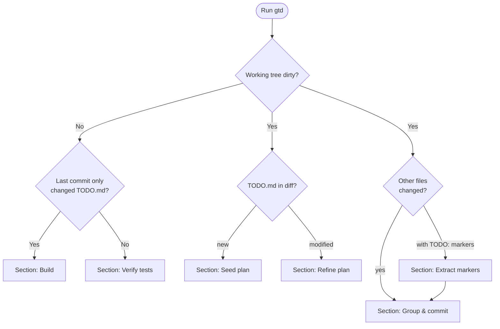

# gi[t]hings.**done**

> [!WARNING]
> This project is an experiment in unapologetic vibe coding. Code might be
> terrible, I don't even know 🤷‍♂️ But otherwise I wouldn't have built it in the
> first place. Now I have something that actually helps me.

A git-aware prompt generator for autonomous coding agents.

`gtd` looks at your working tree and prints a single, self-contained prompt
that tells an agent exactly what to do next — plan, refine the plan, build,
commit, or run the test suite. It never spawns the agent itself; you pipe the
prompt wherever you want.

```bash
gtd | claude
gtd > prompt.md
```

## Installation

```bash
npm install -g githingsdone
```

## Usage

```bash
gtd
```

That's it. No flags, no config file, no init step. Run it inside a git
repository; it inspects the state and writes a markdown prompt to stdout.

## What it does

`gtd` reads the current git state and composes the prompt from a fixed set of
task sections. Multiple sections can fire in the same run — for example, new
`TODO:` markers in code compose with the "group and commit" task.

| State                                                 | Section emitted                          |
| ----------------------------------------------------- | ---------------------------------------- |
| New (untracked / added) `TODO.md`                     | Seed the plan and grill the design       |
| Modified `TODO.md`                                    | Integrate user answers, continue grilling |
| Clean tree, last commit touched only `TODO.md`        | Build every unchecked item, one commit each, then delete `TODO.md` |
| Uncommitted code changes outside `TODO.md`            | Run tests, then group and commit semantically |
| Added/modified lines containing `TODO:` markers       | Extract markers into `TODO.md`, strip from source |
| Clean tree, last commit was not a `TODO.md` checkpoint | Run the full test suite, fix anything broken |

Every prompt also includes:

- A header with the Conventional Commits convention and the rule to always run
  the project's test suite after touching code.
- The current `git diff HEAD` (untracked files included) inline.
- For planning sections, an appendix with the
  [grill-with-docs](https://github.com/mattpocock/skills/tree/main/skills/engineering/grill-with-docs)
  methodology vendored inline.

## Workflow


```mermaid
flowchart TD
    Start([Run gtd]) --> Dirty{Working tree dirty?}
    Dirty -->|No| Last{Last commit only<br/>changed TODO.md?}
    Last -->|Yes| Build[Section: Build]
    Last -->|No| Verify[Section: Verify tests]
    Dirty -->|Yes| Todo{TODO.md in diff?}
    Todo -->|new| Seed[Section: Seed plan]
    Todo -->|modified| Refine[Section: Refine plan]
    Dirty -->|Yes| Other{Other files<br/>changed?}
    Other -->|with TODO: markers| Markers[Section: Extract markers]
    Other -->|yes| Commit[Section: Group & commit]
    Markers --> Commit
```

A typical feature:

1. Create a `TODO.md` with a sketch of what you want.
2. `gtd | claude` — the agent fleshes it out and adds an `## Open Questions`
   section, then commits `docs: seed plan`.
3. Open `TODO.md`, write inline answers under each question.
4. `gtd | claude` again — the agent integrates your answers, removes resolved
   questions, generates new ones, commits `docs: refine plan`. Repeat until
   you're happy.
5. `gtd | claude` once more — agent sees a clean tree + `TODO.md`-only last
   commit and builds every unchecked item, one commit per item, runs tests
   after each, deletes `TODO.md` when done.
6. On a clean tree afterwards, `gtd | claude` runs the test suite as a
   sanity check.

## Q&A format inside TODO.md

The planning sections expect each Open Question to look like this:

```markdown
### What should pagination default to?

**Recommendation:** 25 per page — matches the admin tables elsewhere.

<!-- user answers here -->
```

To answer, replace the comment with your response:

```markdown
### What should pagination default to?

**Recommendation:** 25 per page — matches the admin tables elsewhere.

50 — these tables get long and 25 wastes a click for most users.
```

On the next run, the agent integrates the answer into the plan body and drops
the question from `## Open Questions`.

## Development

```bash
npm install
npm run build        # tsup → dist/gtd.js
npm test             # vitest
npm run test:e2e     # cucumber integration tests
npm run typecheck
npm run lint
```

## License

MIT
