# G*i*tting things done

A file-based, version-controlled, agent-agnostic development workflow.

Just run `gtd` — it figures out what to do next.

## Installation

```bash
npm install -g gtd
```

## How It Works

`gtd` uses emoji-prefixed commits to track where you are in the development
lifecycle. Each time you run `gtd`, it inspects your git state and automatically
picks the next step:

```mermaid
flowchart TD
    Start([Run gtd]) --> Uncommitted{Uncommitted changes?}
    Uncommitted -->|Yes| Feedback["🤦 Commit Feedback: commit your edits"]
    Uncommitted -->|No| CheckLast{Last commit prefix?}
    Feedback --> ReDispatch{Re-dispatch}
    ReDispatch --> CheckLast
    CheckLast -->|🤦 learnings only| Learn["🎓 Learn: persist learnings to AGENTS.md"]
    CheckLast -->|🤦 other changes| Plan["🤖 Plan: refine TODO.md with agent"]
    Plan --> Build["🔨 Build: implement next unchecked item"]
    CheckLast -->|🤖| Build
    Build --> SandboxCheck{Sandbox enabled?}
    SandboxCheck -->|No| RunAgent[Run agent]
    SandboxCheck -->|Yes| RunSandboxed[Run agent in sandbox]
    RunAgent --> ItemsLeft
    RunSandboxed --> ItemsLeft
    ItemsLeft{Unchecked items remain?}
    CheckLast -->|🔨| ItemsLeft
    ItemsLeft -->|Yes| Build
    ItemsLeft -->|No| Learn
    Learn --> Cleanup["🧹 Cleanup: remove TODO.md"]
    CheckLast -->|🎓| Cleanup
    Cleanup --> Idle([Idle: nothing to do])
    CheckLast -->|🧹| Idle
    CheckLast -->|None / unknown| Idle
```



### Commit Prefixes

| Emoji | Step | Meaning |
| ----- | -------- | ---------------------------------------- |
| 🤦 | Feedback | Human edits committed for agent review |
| 🤖 | Plan | Agent refined the plan in TODO.md |
| 🔨 | Build | Agent implemented a TODO item |
| 🎓 | Learn | Learnings persisted to AGENTS.md |
| 🧹 | Cleanup | TODO.md removed, feature complete |

## Example Workflow

### 1. Create a plan

Create a `TODO.md` file in your repository root and commit it:

```md
- add team management page
- paginated listing
- filter by role
- add users (email, real name, roles)
- block/unblock users
```

### 2. Run `gtd`

`gtd` sees uncommitted changes (or a fresh commit without a known prefix) and
starts the planning phase. It invokes your coding agent to turn `TODO.md` into
a detailed action plan:

```md
# Team management

## Action Items

- [ ] Create a new route `/admin/team`
- [ ] Implement listing with pagination
- [ ] Add filters
- [ ] "Add user" dialog
- [ ] "Block user" with confirmation dialog

## Open questions

- Should the filter form automatically submit on change?
- Should filters persist to the URL?
```

The result is committed as `🤖 plan: update TODO.md`.

### 3. Review and give feedback

Open `TODO.md` in your editor, answer questions, and add comments:

```md
## Action Items

- [ ] Create a new route `/admin/team`
- [ ] Implement listing with pagination
- [ ] Add filters
- [ ] "Add user" dialog
  > make sure all operations use optimistic UI patterns
- [ ] "Block user" with confirmation dialog

## Open questions

- Should the filter form automatically submit on change?
  > never do this, it's an accessibility nightmare
- Should filters persist to the URL?
  > yes
```

Run `gtd` again. It commits your feedback as `🤦`, then re-dispatches — since
the last commit is now `🤦`, it immediately refines the plan (`🤖`). Repeat
until the plan is ready.

### 4. Build

Once the plan is solid, run `gtd`. It picks the first unchecked item, invokes
your agent in build mode, runs tests, checks the item off, and commits as `🔨`.
It then automatically continues to the next unchecked item, repeating the cycle
until all items are done — no need to re-run `gtd` between items.

### 5. Learn

When all items are checked, `gtd` stops — the build phase is complete. This is
your chance to review the results and add feedback or learnings to the
`## Learnings` section of `TODO.md`. When you're ready, run `gtd` again. It
commits your edits as `🤦`, detects that only learnings were modified, and
writes them to `AGENTS.md` (committed as `🎓`), followed by cleanup.

### 6. Cleanup

After learnings are committed, `gtd` removes `TODO.md` and commits as `🧹`.
You're done — start a new feature by creating a fresh `TODO.md`.

## Feedback Classification

When `commit-feedback` runs, it classifies each diff hunk independently as
either a **fix** (regular code change) or **feedback** (human commentary for
the agent). Classification uses marker prefixes found in added lines
(case-insensitive):

- `TODO:` — something that needs to be done
- `FIX:` — a known issue to address
- `FIXME:` — same as FIX
- `HACK:` — a workaround that should be improved
- `XXX:` — requires attention

Any hunk containing an added line with one of these markers is classified as
feedback. All other hunks are classified as fixes.

All changes in `TODO.md` are always treated as feedback, regardless of whether
they contain marker prefixes.

## Sandbox Runtime

When `sandboxEnabled` is `true`, `gtd` wraps your chosen agent provider in a
sandbox layer. The sandbox does not replace the agent — it wraps it, adding
isolation and permission controls while delegating all agent logic (prompting,
tool use) to the underlying provider.

### Boundary Levels

Each workflow phase runs at a default boundary level that controls what the
sandboxed agent is allowed to do (file system access, network, etc.):

| Phase | Default Boundary | Description |
| ----- | ---------------- | ----------------------------------- |
| plan | restricted | Read-only, no network |
| build | standard | Read/write project files, network ok |
| learn | restricted | Read-only, no network |

You can override the boundary for any phase via `sandboxBoundaries` in your
config. The three levels — `restricted`, `standard`, and `elevated` — form a
strict ordering.

### Fail-Stop Permissions

Sandbox permissions are fully determined at boot time from the workflow phase
and any user config overrides. There is no runtime escalation — if the agent
needs more permissions than the current boundary allows, the process stops with
an actionable error message. To grant broader access, update your config (e.g.
set `"build": "elevated"` in `sandboxBoundaries`) and re-run `gtd`.

### Guards: Forbidden Tools vs. Sandbox Boundaries

`gtd` applies two independent guard layers to every agent invocation. They are
orthogonal — both are evaluated independently and neither overrides the other:

1. **Forbidden tool blocklists (interactivity guard)** — prevent the agent from
   calling tools that require interactive user input (e.g. `AskUserQuestion` in
   Claude, `question` in OpenCode). These blocklists are internal and not
   user-configurable; they are derived from each agent provider's tool catalog.
   When a forbidden tool is detected, the invocation fails immediately.

2. **Sandbox boundaries (isolation guard)** — control what the sandboxed agent
   can access (file system, network). These are user-configurable via
   `sandboxBoundaries`. Permissions are fixed at boot; violations stop the
   process rather than prompting for escalation.

## Configuration

`gtd` uses file-based configuration via [cosmiconfig](https://github.com/cosmiconfig/cosmiconfig).
Environment variables are **not** used for configuration.

### Config File Locations

Config files are searched in the following order (highest priority first):

1. **Project directory** (and parent directories) — cosmiconfig default search
2. **`$XDG_CONFIG_HOME/gtd/`** — e.g. `~/.config/gtd/.gtdrc.json`
3. **`$XDG_CONFIG_HOME/`** — e.g. `~/.config/.gtdrc.json`
4. **`$HOME/`** — e.g. `~/.gtdrc.json`

When multiple config files are found, they are merged with higher-priority
files overriding lower-priority ones (shallow merge).

### Supported File Formats

Any format supported by cosmiconfig:

- `.gtdrc` (JSON)
- `.gtdrc.json`
- `.gtdrc.yaml` / `.gtdrc.yml`
- `.gtdrc.js` / `.gtdrc.cjs` / `.gtdrc.mjs`
- `.gtdrc.ts` / `.gtdrc.cts` / `.gtdrc.mts`
- `gtd.config.js` / `gtd.config.cjs` / `gtd.config.mjs`
- `gtd.config.ts` / `gtd.config.cts` / `gtd.config.mts`

### Sample `.gtdrc.json`

```jsonc
{
  "$schema": "https://raw.githubusercontent.com/pmelab/gtd/main/schema.json",

  // Planning file path (relative to project root)
  // Default: "TODO.md"
  "file": "TODO.md",

  // Agent selection: "auto", "pi", "opencode", or "claude"
  // "auto" tries pi → opencode → claude in order
  // Default: "auto"
  "agent": "auto",

  // Agent mode overrides for each phase
  // Default: "plan"
  "agentPlan": "plan",
  // Default: "code"
  "agentBuild": "code",
  // Default: "plan"
  "agentLearn": "plan",

  // Test command run after each build step
  // Default: "npm test"
  "testCmd": "npm test",

  // Max test retries before giving up (must be >= 0)
  // Default: 10
  "testRetries": 10,

  // Prompt template for generating commit messages
  // Use {{diff}} as a placeholder for the staged diff
  // Default: "Look at the following diff and create a concise commit message, following the conventional commit standards:\n\n{{diff}}"
  "commitPrompt": "Look at the following diff and create a concise commit message, following the conventional commit standards:\n\n{{diff}}",

  // Seconds before the agent times out due to inactivity (must be >= 0)
  // Default: 300
  "agentInactivityTimeout": 300,

  // Enable sandbox runtime wrapping around the agent provider
  // Default: false
  "sandboxEnabled": true,

  // Override default boundary levels per workflow phase
  // Default: plan=restricted, build=standard, learn=restricted
  "sandboxBoundaries": {
    "build": "elevated"
  }
}
```

### Agents

The following agents are supported:

- Pi (id: `pi`)
- Opencode (id: `opencode`)
- Claude Code (id: `claude`)

When `agent` is set to `"auto"` (the default), `gtd` tries them in the order
listed above and uses the first one available.
