# gi\_[t]\_hings.**done**

> [!WARNING] This project is an experiment in unapologetic vibe coding. Code
> might be terrible, I don't even know 🤷‍♂️ But otherwise I wouldn't have built it
> in the first place. Now I have something that actually helps me.

A file-based, version-controlled, agentic development workflow.

Create a `TODO.md` and run `gtd` — it figures out what to do next.

## Installation

```bash
npm install -g gtd
```

## Usage

```bash
gtd              # run the workflow
gtd init         # scaffold a project-local .gtdrc.json
gtd init --global # scaffold a user-level config in ~/.config/gtd/
```

Flags:

- `--quiet` / `-q` — suppress agent output, show only commits
- `--verbose` / `-v` — show thinking deltas and tool invocations
- `--debug` — print internal state transitions

## How It Works

`gtd` uses emoji-prefixed commits to track where you are in the development
lifecycle. Each time you run `gtd`, it inspects your git state and automatically
picks the next step:

```mermaid
flowchart TD
    Start([Run gtd]) --> Uncommitted{Uncommitted changes?}
    Uncommitted -->|No| CheckLast{Last commit prefix?}
    Uncommitted -->|Yes| Classify["Classify diff into up to 4 commits"]
    Classify --> SeedCommit["🌱 Seed: new TODO.md"]
    Classify --> HumanCommit["🤦 Human: TODO.md edits or code with feedback markers"]
    Classify --> FixCommit["👷 Fix: non-feedback code changes"]
    SeedCommit --> ReDispatch
    HumanCommit --> ReDispatch
    FixCommit --> ReDispatch
    ReDispatch{Re-dispatch} --> CheckLast
    CheckLast -->|"🌱 / 🤦"| Plan["🤖 Plan: refine TODO.md with agent"]
    CheckLast -->|🤖| Build
    CheckLast -->|"🔨 / 👷"| TodoNew{TODO.md is new?}
    TodoNew -->|Yes| Plan
    TodoNew -->|No| ItemsLeft
    Build["🔨 Build: implement next unchecked item"] --> ItemsLeft
    ItemsLeft{Unchecked items remain?}
    ItemsLeft -->|Yes| Build
    ItemsLeft -->|No| Cleanup["🧹 Cleanup: remove TODO.md"]
    Plan --> Build
    Cleanup --> Idle([Idle: nothing to do])
    CheckLast -->|"🧹 / 🎓"| Idle
    CheckLast -->|"None / unknown + TODO.md new"| Plan
    CheckLast -->|"None / unknown + no TODO.md"| Idle
```



### Commit Prefixes

| Emoji | Step     | Meaning                                                      |
| ----- | -------- | ------------------------------------------------------------ |
| 🌱    | Seed     | New TODO.md file committed (first plan seed)                        |
| 🤦    | Human    | TODO.md edits/blockquotes or code with feedback markers (TODO:, FIX:, etc.) |
| 👷    | Fix      | Non-feedback code changes (regular fixes)                    |
| 🤖    | Plan     | Agent refined the plan in TODO.md                            |
| 🔨    | Build    | Agent implemented a TODO item                                |
| 🎓    | Learn    | Agent extracted learnings from completed work                |
| 🧹    | Cleanup  | TODO.md removed, feature complete                            |

## Example Workflow

### 1. Create a plan

Create a `TODO.md` file in your repository root and commit it:

```md
- add team management page
- paginated listing
- filter by role
- add users (email, real name, roles)
- block/unblock users
```

### 2. Run `gtd`

`gtd` sees uncommitted changes (or a fresh commit without a known prefix) and
starts the planning phase. It invokes your coding agent to turn `TODO.md` into a
detailed action plan:

```md
# Team management

## Action Items

- [ ] Create a new route `/admin/team`
- [ ] Implement listing with pagination
- [ ] Add filters
- [ ] "Add user" dialog
- [ ] "Block user" with confirmation dialog

## Open questions

- Should the filter form automatically submit on change?
- Should filters persist to the URL?
```

The result is committed as `🤖 plan: update TODO.md`.

### 3. Review and give feedback

Open `TODO.md` in your editor, answer questions, and add comments:

```md
## Action Items

- [ ] Create a new route `/admin/team`
- [ ] Implement listing with pagination
- [ ] Add filters
- [ ] "Add user" dialog
  > make sure all operations use optimistic UI patterns
- [ ] "Block user" with confirmation dialog

## Open questions

- Should the filter form automatically submit on change?
  > never do this, it's an accessibility nightmare
- Should filters persist to the URL?
  > yes
```

Run `gtd` again. It classifies your changes into separate commits by type:
blockquote feedback and edits in TODO.md become a 🤦 HUMAN commit, code changes
with marker comments (TODO:, FIX:, etc.) also become a 🤦 HUMAN commit, and
plain code fixes become a 👷 commit. After committing, `gtd` checks the last
prefix and routes accordingly — since 🤦 routes to plan, it immediately refines
the plan (`🤖`). Repeat until the plan is ready.

### 4. Build

Once the plan is solid, run `gtd`. It picks the first unchecked item, invokes
your agent in build mode, runs tests, checks the item off, and commits as `🔨`.
It then automatically continues to the next unchecked item, repeating the cycle
until all items are done — no need to re-run `gtd` between items.

### 5. Cleanup

When all items are checked, `gtd` automatically removes `TODO.md` and commits as
`🧹`. You're done — start a new feature by creating a fresh `TODO.md`.

## Feedback Classification

When `commit-feedback` runs, it splits the diff into 4 categories using
`DiffClassifier.classifyDiff`: `seed`, `feedback`, `humanTodos`, and `fixes`.
Each hunk is classified independently based on the file it belongs to and its
content.

### 4-Way Diff Classification

| Category     | Condition                                                    | Commit |
| ------------ | ------------------------------------------------------------ | ------ |
| `seed`       | New TODO.md file (first plan seed)                           | 🌱     |
| `feedback`   | Changes to an existing TODO.md (edits, blockquote additions) | 🤦     |
| `humanTodos` | Code hunks containing feedback marker comments               | 🤦     |
| `fixes`      | Plain code hunks without marker prefixes                     | 👷     |

### Marker Prefixes

Feedback markers are detected in added lines (case-insensitive):

- `TODO:` — something that needs to be done
- `FIX:` — a known issue to address
- `FIXME:` — same as FIX
- `HACK:` — a workaround that should be improved
- `XXX:` — requires attention

Any hunk containing an added line with one of these markers is classified as
human feedback. All other code hunks are classified as fixes.

### Blockquote Detection

Blockquote additions in TODO.md are detected via the `BLOCKQUOTE_ADDITION` regex
(`/^\+\s*> /`). Hunks where every added line starts with `> ` are recognized as
blockquote feedback and included in the `feedback` category.

All changes in `TODO.md` are always treated as feedback (or seed if the file is
new), regardless of whether they contain marker prefixes.

### Multi-Commit Behavior

When multiple categories are present in a single diff, each gets its own
separate commit. Individual patches are staged via `git.stageByPatch` so that
each commit contains only the hunks belonging to its category.

### Prefix Classification Priority

When determining the overall prefix for re-dispatch, `classifyPrefix` uses a
fixed priority order: 🌱 > 🤦 > 👷. The first non-empty category in this
order wins.

## Configuration

`gtd` uses file-based configuration via
[cosmiconfig](https://github.com/cosmiconfig/cosmiconfig). Environment variables
are **not** used for configuration.

### Generating a Config File

Use `gtd init` to scaffold a project-local `.gtdrc.json` in the current
directory:

```sh
gtd init
```

For a user-level (global) config, use `gtd init --global` which creates the file
under `$XDG_CONFIG_HOME/gtd/` (defaults to `~/.config/gtd/`):

```sh
gtd init --global
```

Both commands write an example `.gtdrc.json` with a `$schema` reference and skip
creation if the file already exists.

### Config File Locations

Config files are searched in the following order (highest priority first):

1. **Project directory** (and parent directories) — cosmiconfig default search
2. **`$XDG_CONFIG_HOME/gtd/`** — e.g. `~/.config/gtd/.gtdrc.json`
3. **`$XDG_CONFIG_HOME/`** — e.g. `~/.config/.gtdrc.json`
4. **`$HOME/`** — e.g. `~/.gtdrc.json`

When multiple config files are found, they are merged with higher-priority files
overriding lower-priority ones (shallow merge).

### Supported File Formats

Any format supported by cosmiconfig:

- `.gtdrc` (JSON)
- `.gtdrc.json`
- `.gtdrc.yaml` / `.gtdrc.yml`
- `.gtdrc.js` / `.gtdrc.cjs` / `.gtdrc.mjs`
- `.gtdrc.ts` / `.gtdrc.cts` / `.gtdrc.mts`
- `gtd.config.js` / `gtd.config.cjs` / `gtd.config.mjs`
- `gtd.config.ts` / `gtd.config.cts` / `gtd.config.mts`

### Sample `.gtdrc.json`

```jsonc
{
  "$schema": "https://raw.githubusercontent.com/pmelab/gtd/main/schema.json",

  // Planning file path (relative to project root)
  // Default: "TODO.md"
  "file": "TODO.md",

  // Model overrides for each phase (optional)
  // Format: "provider/modelId" e.g. "anthropic/claude-sonnet-4-20250514"
  "modelPlan": "anthropic/claude-sonnet-4-20250514",
  "modelBuild": "anthropic/claude-sonnet-4-20250514",
  "modelCommit": "anthropic/claude-haiku-4-5-20251001",

  // Test command run after each build step
  // Default: "npm test"
  "testCmd": "npm test",

  // Max test retries before giving up (must be >= 0)
  // Default: 10
  "testRetries": 10,

  // Prompt template for generating commit messages
  // Use {{diff}} as a placeholder for the staged diff
  "commitPrompt": "Look at the following diff and create a concise commit message, following the conventional commit standards:\n\n{{diff}}",

  // Seconds before the agent times out due to inactivity (must be >= 0)
  // Default: 300
  "agentInactivityTimeout": 300,
}
```
