# G*i*tting things done

A file-based, version-controlled, agent-agnostic development workflow.

Just run `gtd` — it figures out what to do next.

## Installation

```bash
npm install -g gtd
```

## How It Works

`gtd` uses emoji-prefixed commits to track where you are in the development
lifecycle. Each time you run `gtd`, it inspects your git state and automatically
picks the next step:

```mermaid
flowchart TD
    Start([Run gtd]) --> Uncommitted{Uncommitted changes?}
    Uncommitted -->|Yes, learnings only| Learn["🎓 Learn: persist learnings to AGENTS.md"]
    Uncommitted -->|Yes, other changes| Feedback["🤦 Commit Feedback: commit your edits"]
    Uncommitted -->|No| CheckLast{Last commit prefix?}
    Feedback --> Plan["🤖 Plan: refine TODO.md with agent"]
    CheckLast -->|🤦| Plan
    Plan --> Build["🔨 Build: implement next unchecked item"]
    CheckLast -->|🤖| Build
    Build --> ItemsLeft{Unchecked items remain?}
    CheckLast -->|🔨| ItemsLeft
    ItemsLeft -->|Yes| Build
    ItemsLeft -->|No| Learn
    Learn --> Cleanup["🧹 Cleanup: remove TODO.md"]
    CheckLast -->|🎓| Cleanup
    Cleanup --> Idle([Idle: nothing to do])
    CheckLast -->|🧹| Idle
    CheckLast -->|None / unknown| Idle
```



### Commit Prefixes

| Emoji | Step | Meaning |
| ----- | -------- | ---------------------------------------- |
| 🤦 | Feedback | Human edits committed for agent review |
| 🤖 | Plan | Agent refined the plan in TODO.md |
| 🔨 | Build | Agent implemented a TODO item |
| 🎓 | Learn | Learnings persisted to AGENTS.md |
| 🧹 | Cleanup | TODO.md removed, feature complete |

## Example Workflow

### 1. Create a plan

Create a `TODO.md` file in your repository root and commit it:

```md
- add team management page
- paginated listing
- filter by role
- add users (email, real name, roles)
- block/unblock users
```

### 2. Run `gtd`

`gtd` sees uncommitted changes (or a fresh commit without a known prefix) and
starts the planning phase. It invokes your coding agent to turn `TODO.md` into
a detailed action plan:

```md
# Team management

## Action Items

- [ ] Create a new route `/admin/team`
- [ ] Implement listing with pagination
- [ ] Add filters
- [ ] "Add user" dialog
- [ ] "Block user" with confirmation dialog

## Open questions

- Should the filter form automatically submit on change?
- Should filters persist to the URL?
```

The result is committed as `🤖 plan: update TODO.md`.

### 3. Review and give feedback

Open `TODO.md` in your editor, answer questions, and add comments:

```md
## Action Items

- [ ] Create a new route `/admin/team`
- [ ] Implement listing with pagination
- [ ] Add filters
- [ ] "Add user" dialog
  > make sure all operations use optimistic UI patterns
- [ ] "Block user" with confirmation dialog

## Open questions

- Should the filter form automatically submit on change?
  > never do this, it's an accessibility nightmare
- Should filters persist to the URL?
  > yes
```

Run `gtd` again. It commits your feedback as `🤦`, then immediately refines the
plan (`🤖`). Repeat until the plan is ready.

### 4. Build

Once the plan is solid, run `gtd`. It picks the first unchecked item, invokes
your agent in build mode, runs tests, checks the item off, and commits as `🔨`.
Run `gtd` again to build the next item. The loop continues until all items are
checked.

### 5. Learn

When all items are checked, `gtd` extracts learnings from the completed work
into the `## Learnings` section of `TODO.md`. Review the learnings in your
editor. If you want to persist them, run `gtd` again — it detects learnings-only
changes and writes them to `AGENTS.md` (committed as `🎓`).

### 6. Cleanup

After learnings are committed, `gtd` removes `TODO.md` and commits as `🧹`.
You're done — start a new feature by creating a fresh `TODO.md`.

## Configuration

### Agents

The following agents are supported:

- Pi (id: `pi`)
- Opencode (id: `opencode`)
- Claude Code (id: `claude`)

`gtd` will attempt to use them in this order. Override with the `GTD_AGENT`
environment variable.

### Planning file

Use `GTD_FILE` to configure a specific planning file. Defaults to `TODO.md`.

### Commits

The `GTD_COMMIT_PROMPT` is used to generate commit messages. It defaults to:

```md
Look at the following diff and create a concise commit message, following the
conventional commit standards:

{{diff}}
```

### Testing

The build step runs tests after each item. Configure the test command with
`GTD_TEST_CMD` (defaults to `npm test`). Tests are retried up to
`GTD_TEST_RETRIES` times (defaults to `10`).

### Agent Behavior

- `GTD_AGENT_INACTIVITY_TIMEOUT`: Seconds before the agent times out due to
  inactivity (defaults to `300`).
- `GTD_AGENT_FORBIDDEN_TOOLS`: Comma-separated list of agent tools to forbid
  (defaults to `AskUserQuestion`).
